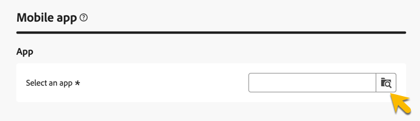
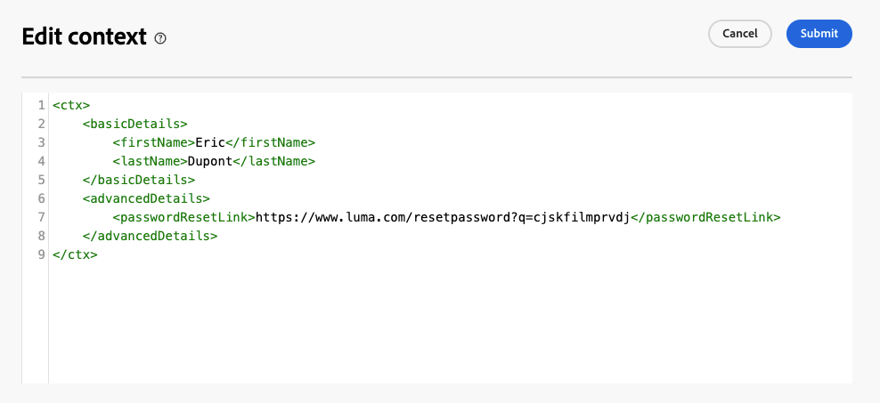

# Skapa transaktionsmeddelanden

Vid transaktionsmeddelanden utlöser en händelse att ett personligt meddelande skickas. Om du vill aktivera det här skapar du en meddelandemall för varje händelsetyp. Mallarna innehåller all information som krävs för att personalisera transaktionsmeddelandet.

## Skapa en mall för transaktionsmeddelanden {#transactional-template}

I Campaign Web User Interface är det första steget i konfigurationen av transaktionsmeddelanden att skapa mallen eller att skapa meddelandet direkt. Detta skiljer sig från [konfigurationen av transaktionsmeddelanden på klientkonsolen](https://experienceleague.adobe.com/en/docs/campaign/campaign-v8/send/real-time/transactional).

En mall för transaktionsmeddelanden kan användas för att förhandsgranska det leveransinnehåll som tas emot av profilen innan den når den slutliga målgruppen. En administratör kan till exempel konfigurera och konfigurera mallarna så att de blir klara för marknadsföringsanvändare.

Följ stegen nedan för att skapa en mall för transaktionsmeddelanden:

* Gå till **[!UICONTROL Triggered messages]** i avsnittet **[!UICONTROL Transactional messages]**. På fliken **[!UICONTROL Templates]** kan du se alla leveransmallar för transaktionsmeddelanden. Klicka på knappen **[!UICONTROL Create transactional message template]** för att börja skapa mallen.

  {zoomable="yes"}

* Välj kanalen för mallen på den nya sidan som visas. I det här exemplet väljer du kanalen **[!UICONTROL Email]**. Du kan också arbeta från en annan meddelandemall och välja den i listan Mallar.

  {zoomable="yes"}

  Klicka igen på knappen **[!UICONTROL Create transactional message]** för att validera att mallen skapas på den valda kanalen.

* Få åtkomst till konfigurationen för transaktionsmeddelandemallen.

  {zoomable="yes"}

### Egenskaper för transaktionsmeddelande {#transactional-properties}

>[!CONTEXTUALHELP]
>id="acw_transacmessages_properties"
>title="Egenskaper för transaktionsmeddelanden"
>abstract="Fyll i det här formuläret om du vill konfigurera egenskaper för transaktionsmeddelanden."

>[!CONTEXTUALHELP]
>id="acw_transacmessages_email_properties"
>title="E-postegenskaper för transaktionsmeddelanden"
>abstract="Fyll i det här formuläret om du vill konfigurera e-postegenskaperna för transaktionsmeddelanden."

>[!CONTEXTUALHELP]
>id="acw_transacmessages_sms_properties"
>title="SMS-egenskaper för transaktionsmeddelanden"
>abstract="Fyll i det här formuläret om du vill konfigurera SMS-egenskaper för transaktionsmeddelanden."

>[!CONTEXTUALHELP]
>id="acw_transacmessages_push_properties"
>title="Push-egenskaper för transaktionsmeddelanden"
>abstract="Fyll i det här formuläret om du vill konfigurera push-egenskaperna för transaktionsmeddelanden."

Avsnittet **[!UICONTROL Properties]** i ett transaktionsmeddelande hjälper dig att konfigurera:

* **[!UICONTROL Label]**, som är det namn som visas i transaktionsmeddelandelistan. Gör det tydligt för forskning och framtida användning.
* **[!UICONTROL Internal name]**, som är ett unikt namn som skiljer ditt meddelande från andra meddelanden som skapas.
* **[!UICONTROL Folder]**, där transaktionsmeddelandemallen skapas.
* **[!UICONTROL Execution folder]**, där meddelandet lagras efter körning.
* **[!UICONTROL Delivery code]**, som är en kod som hjälper till att identifiera meddelandet för rapportering, vid behov.
* **[!UICONTROL Description]**.
* **[!UICONTROL Nature]**, som är typen av leverans, enligt listan i uppräkningen *deliveryNature*. [Läs mer om uppräkningar](https://experienceleague.adobe.com/en/docs/campaign/campaign-v8/config/configuration/ui-settings#enumerations).

{zoomable="yes"}

### Mobilapp {#mobile-app}

>[!CONTEXTUALHELP]
>id="acw_transacmessages_mobileapp"
>title="Mobilappen Transactional Messaging"
>abstract="I det här avsnittet kan du välja programmet där du vill skicka meddelandet."

I det här avsnittet väljer du det program där du vill skicka meddelandet.

Genom att klicka på sökikonen öppnar du listan över mobilprogram i din Adobe Campaign-instans.

{zoomable="yes"}

### Context sample {#context-sample}

>[!CONTEXTUALHELP]
>id="acw_transacmessages_context"
>title="Kontext för transaktionsmeddelanden"
>abstract="Med kontextexemplet kan du skapa en testhändelse för att förhandsgranska det transaktionsmeddelande som tas emot med profilpersonaliseringen."

>[!CONTEXTUALHELP]
>id="acw_transacmessages_addcontext"
>title="Kontext för transaktionsmeddelanden"
>abstract="Med kontextexemplet kan du skapa en testhändelse för att förhandsgranska det transaktionsmeddelande som tas emot med profilpersonaliseringen."

Med kontextexemplet kan du skapa en testhändelse för att förhandsgranska det transaktionsmeddelande som tas emot med profilpersonaliseringen.

Det här steget är valfritt. Du kan använda mallen utan kontextexemplet, men nackdelen är att du inte kan förhandsgranska det anpassade innehållet.

I exemplet med att ange lösenordet skickas användarens förnamn, efternamn och en personlig länk för att återställa lösenordet. Kontexten kan konfigureras enligt nedan.

Innehållet i sammanhanget beror på den personalisering du behöver.

{zoomable="yes"}

### Mallinnehåll för transaktionsmeddelanden {#transactional-content}

>[!CONTEXTUALHELP]
>id="acw_transacmessages_content"
>title="Transactional messaging content"
>abstract="Lär dig hur du skapar transaktionsmeddelandeinnehåll."

>[!CONTEXTUALHELP]
>id="acw_transacmessages_personalization"
>title="Personalisering av transaktionsmeddelanden"
>abstract="Lär dig hur du personaliserar transaktionsinnehållet."

>[!CONTEXTUALHELP]
>id="acw_personalization_editor_event_context"
>title="Händelsekontext"
>abstract="Den här menyn innehåller variabler från den utlösande händelsen som du kan använda för att anpassa ditt transaktionsmeddelandeinnehåll."

Att arbeta med innehållet i ett transaktionsmeddelande påminner om att skapa innehåll för en leverans. Klicka på **[!UICONTROL Open email designer]** eller **[!UICONTROL Edit email body]** och välj ett mallinnehåll eller importera din HTML-kod.

{zoomable="yes"}

Om du vill lägga till en personalisering i innehållet klickar du på det avsnitt där du vill lägga till det och väljer ikonen **[!UICONTROL Add Personalization]**.

{zoomable="yes"}

Öppna fönstret **[!UICONTROL Edit personalisation]**. Om du vill lägga till variabler från utlösarhändelsen klickar du på ikonen **[!UICONTROL Event context]**. Navigera till kontexten som du har definierat för mallen ([läs mer om kontexten](#context-sample)) och klicka på knappen **[!UICONTROL +]** för att infoga variabeln som krävs.

Bilden nedan visar hur du lägger till personalisering för förnamnet.

{zoomable="yes"}

I det här exemplet lägger du till förnamnet, efternamnet och anpassar knapplänken **[!UICONTROL Reset your password]**.

{zoomable="yes"}

### Förhandsgranska mallen

Förhandsgranska mallinnehållet och kontrollera personaliseringen när du skapar mallen.

Om du vill göra det fyller du i [kontextexemplet](#context-sample) och klickar på knappen **[!UICONTROL Simulate content]**.

{zoomable="yes"}

## Skapa ett transaktionsmeddelande {#transactional-message}

Du kan skapa ett transaktionsmeddelande direkt eller genom att använda en transaktionsmeddelandemall. [Lär dig hur du skapar en mall för transaktionsmeddelanden](#transactional-template).

Följ stegen nedan för att skapa ett transaktionsmeddelande:

* Gå till **[!UICONTROL Triggered messages]** i avsnittet **[!UICONTROL Transactional messages]**. På fliken **[!UICONTROL Browse]** kan du se alla transaktionsmeddelanden som har skapats. Klicka på knappen **[!UICONTROL Create transactional message]** för att börja skapa meddelandet.

  {zoomable="yes"}

* På den nya sidan som visas väljer du kanalen för meddelandet och väljer den mall som du vill arbeta med. I det här exemplet väljer du [mallen som skapades tidigare](#transactional-template).

  {zoomable="yes"}

  Klicka igen på knappen **[!UICONTROL Create transactional message]** för att validera att meddelandet har skapats i den valda kanalen.

* Få åtkomst till konfigurationen av ditt transaktionsmeddelande. Meddelandet ärver mallens konfiguration. Den här sidan är nästan identisk med konfigurationssidan för transaktionsmeddelandemallar, förutom att den även innehåller händelsetypskonfigurationen.

  {zoomable="yes"}

  Fyll i konfigurationen för meddelandet som för en mall:
   * [Egenskaper för transaktionsmeddelande](#transactional-properties)
   * [Context sample](#context-sample)
   * [Meddelandeinnehåll](#transactional-content)
och [konfigurera händelsetypen](#event-type) enligt anvisningarna nedan.

* När [du har verifierat ditt transaktionsmeddelande](validate-transactional.md) klickar du på knappen **[!UICONTROL Review and publish]** för att skapa och publicera meddelandet. Utlösarna kan nu skicka transaktionsmeddelanden.

### Om händelsetypen {#event-type}

>[!CONTEXTUALHELP]
>id="acw_transacmessages_event"
>title="Transactional Messaging-händelse"
>abstract="Konfigurationen för händelsetypen länkar meddelandet till utlösarhändelsen."

Konfigurationen för händelsetypen länkar meddelandet till utlösarhändelsen.

Välj en händelsetyp som redan har skapats eller skapa en händelsetyp direkt på den här konfigurationssidan i Campaign Web User Interface.

{zoomable="yes"}

>[!CAUTION]
>
>Om du väljer en händelsetyp som för närvarande används av ett annat transaktionsmeddelande, kommer båda meddelandena att utlösas. **Länka en händelsetyp till endast ETT transaktionsmeddelande för bästa praxis.**

## Lägg till erbjudanden i transaktionsmeddelanden {#transactional-offers}

Ni kan inkludera erbjudanden i era transaktionsmeddelanden, så att ni kan presentera relevanta förslag för era slutanvändare, även när meddelandet utlöses av en händelse.

Den här funktionen är tillgänglig under redigeringsfasen av ditt transaktionsmeddelande. Klicka på knappen **[!UICONTROL Set up offers]** för att konfigurera den.

Konfigurationsprocessen är identisk med att konfigurera erbjudanden för standardleveranser. [Lär dig hur du lägger till erbjudanden i ditt meddelande](../msg/offers.md).

{zoomable="yes"}