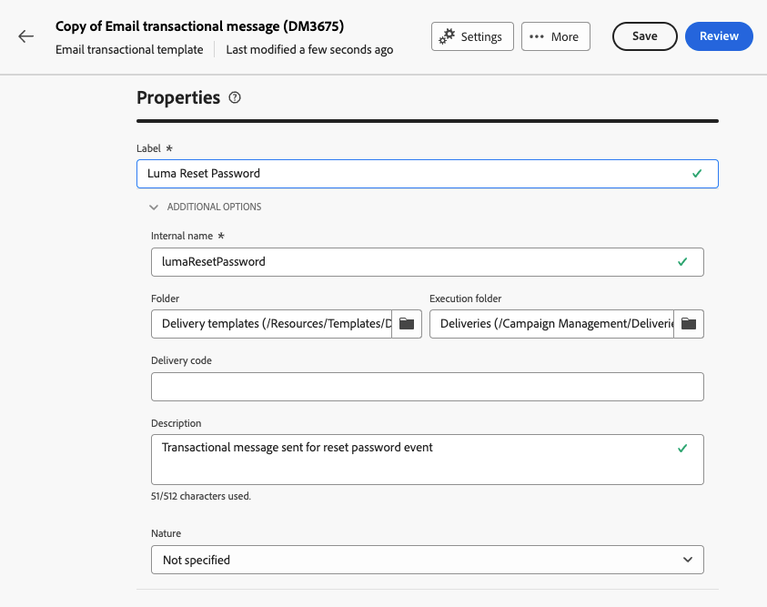

# Skapa transaktionsmeddelanden

Vid transaktionsmeddelanden utlöser en händelse att ett personligt meddelande skickas.
Om du vill aktivera detta måste du skapa en meddelandemall för varje händelsetyp. Mallarna innehåller all information som krävs för att personalisera transaktionsmeddelandet.

## Skapa en mall för transaktionsmeddelanden {#transactional-template}

I Campaign Web User Interface är det första steget i konfigurationen av transaktionsmeddelanden att skapa mallen eller att skapa meddelandet direkt. Detta skiljer sig åt med [konfigurationen av transaktionsmeddelanden på klientkonsolen](https://experienceleague.adobe.com/en/docs/campaign/campaign-v8/send/real-time/transactional).

En mall för transaktionsmeddelanden kan användas för att förhandsgranska det leveransinnehåll som tas emot av profilen innan den når den slutliga målgruppen. En administratör kan till exempel konfigurera och konfigurera mallarna så att de blir klara för marknadsföringsanvändare.

Följ stegen nedan för att skapa en mall för transaktionsmeddelanden:

* Gå till **[!UICONTROL Transactional messages]** i avsnittet **[!UICONTROL Triggered messages]**. På fliken **[!UICONTROL Templates]** kan du se alla leveransmallar för transaktionsmeddelanden. Klicka på knappen **[!UICONTROL Create transactional message template]** för att börja skapa mallen.

  {zoomable="yes"}

* Välj kanalen för mallen på den nya sidan som visas. I vårt exempel väljer vi **[!UICONTROL Email]** kanal. Du kan också arbeta från en annan meddelandemall och välja den i listan Mallar.

  {zoomable="yes"}

  Klicka igen på knappen **[!UICONTROL Create transactional message]** för att validera att mallen skapas på den valda kanalen.

* Du har nu åtkomst till konfigurationen av mallen för transaktionsmeddelanden.

  {zoomable="yes"}

### Egenskaper för transaktionsmeddelande {#transactional-properties}

>[!CONTEXTUALHELP]
>id="acw_transacmessages_properties"
>title="Egenskaper för transaktionsmeddelanden"
>abstract="Fyll i det här formuläret för att konfigurera egenskaper för transaktionsmeddelanden"

>[!CONTEXTUALHELP]
>id="acw_transacmessages_email_properties"
>title="E-postegenskaper för transaktionsmeddelanden"
>abstract="Fyll i det här formuläret för att konfigurera e-postegenskaperna för transaktionsmeddelanden"

>[!CONTEXTUALHELP]
>id="acw_transacmessages_sms_properties"
>title="SMS-egenskaper för transaktionsmeddelanden"
>abstract="Fyll i det här formuläret för att konfigurera SMS-egenskaper för transaktionsmeddelanden"

>[!CONTEXTUALHELP]
>id="acw_transacmessages_push_properties"
>title="Push-egenskaper för transaktionsmeddelanden"
>abstract="Fyll i det här formuläret för att konfigurera push-egenskaper för transaktionsmeddelanden"

Avsnittet **[!UICONTROL Properties]** i ett transaktionsmeddelande hjälper dig att konfigurera:

* **[!UICONTROL Label]** är det namn som visas i transaktionsmeddelandelistan. Gör det tydligt för forskning och framtida användning.
* **[!UICONTROL Internal name]** är ett unikt namn som skiljer ditt meddelande från de andra meddelanden som skapas.
* **[!UICONTROL Folder]** är den plats där transaktionsmeddelandemallen skapas.
* **[!UICONTROL Execution folder]** är den plats där meddelandet lagras efter körning.
* **[!UICONTROL Delivery code]**: En kod som hjälper till att identifiera meddelandet för rapportering, om det behövs.
* **[!UICONTROL Description]**
* **[!UICONTROL Nature]** är typen av leverans, enligt listan i uppräkningen *deliveryNature*. [Läs mer om uppräkningar](https://experienceleague.adobe.com/en/docs/campaign/campaign-v8/config/configuration/ui-settings#enumerations)

{zoomable="yes"}

### Mobilapp {#mobile-app}

>[!CONTEXTUALHELP]
>id="acw_transacmessages_mobileapp"
>title="Mobilappen Transactional Messaging"
>abstract="I det här avsnittet kan du välja programmet där du vill skicka meddelandet."

I det här avsnittet kan du välja programmet där du vill skicka meddelandet.

Genom att klicka på reservoarikonen får du tillgång till mobilprogrammet som visas i din Adobe Campaign-instans.

{zoomable="yes"}

### Context sample {#context-sample}

>[!CONTEXTUALHELP]
>id="acw_transacmessages_context"
>title="Kontext för transaktionsmeddelanden"
>abstract="Med kontextexemplet kan du skapa en testhändelse för att förhandsgranska det transaktionsmeddelande som tas emot med profilpersonaliseringen."

>[!CONTEXTUALHELP]
>id="acw_transacmessages_addcontext"
>title="Kontext för transaktionsmeddelanden"
>abstract="Med kontextexemplet kan du skapa en testhändelse för att förhandsgranska det transaktionsmeddelande som tas emot med profilpersonaliseringen. "

Med kontextexemplet kan du skapa en testhändelse för att förhandsgranska det transaktionsmeddelande som tas emot med profilpersonaliseringen.

Det här steget är valfritt. Du kan använda mallen utan kontextexemplet, men nackdelen är att du inte kan förhandsgranska det anpassade innehållet.

I vårt exempel på hur du ställer in lösenordet skickar händelsen användarens förnamn, efternamn och en personlig länk för att återställa lösenordet. Kontexten kan konfigureras enligt nedan.

Innehållet i sammanhanget beror på den personalisering du behöver.

{zoomable="yes"}

### Mallinnehåll för transaktionsmeddelanden {#transactional-content}

>[!CONTEXTUALHELP]
>id="acw_transacmessages_content"
>title="Transactional messaging content"
>abstract="Lär dig hur du skapar innehåll för transaktionsmeddelanden"

>[!CONTEXTUALHELP]
>id="acw_transacmessages_personalization"
>title="Personalisering av transaktionsmeddelanden"
>abstract="Lär dig hur du kan personalisera transaktionsmeddelandeinnehåll"

Att arbeta med innehållet i ett transaktionsmeddelande är som att skapa innehållet i en leverans. Klicka på **[!UICONTROL Open email designer]** eller **[!UICONTROL Edit email body]** och välj ett mallinnehåll eller importera HTML-kod.

{zoomable="yes"}

Om du vill lägga till personaliseringen i innehållet klickar du på det avsnitt där du vill lägga till den och väljer ikonen **[!UICONTROL Add Personalization]**.

{zoomable="yes"}

Du får åtkomst till fönstret **[!UICONTROL Edit personalisation]**.
Om du vill lägga till variablerna från utlösarhändelsen klickar du på ikonen **[!UICONTROL Event context]**. Du kan navigera i kontexten som du definierade för mallen ([läs mer om kontexten](#context-sample)) och klicka på knappen **[!UICONTROL +]** för att infoga variabeln som behövs.

I bilden nedan ser du hur du lägger till personaliseringen av förnamnet.

{zoomable="yes"}

I vårt exempel lägger vi till förnamnet, sedan efternamnet, och vi anpassar knapplänken **[!UICONTROL Reset your password]**.

{zoomable="yes"}

### Förhandsgranska mallen

I det här skedet av mallskapandet kanske du vill förhandsgranska mallinnehållet och kontrollera personaliseringen.

Om du vill göra det fyller du i [kontextexemplet](#context-sample) och klickar på knappen **[!UICONTROL Simulate content]**.

{zoomable="yes"}

## Skapa ett transaktionsmeddelande {#transactional-message}

Du kan skapa ett transaktionsmeddelande direkt eller genom att använda en transaktionsmeddelandemall. [Lär dig hur du skapar en mall för transaktionsmeddelanden](#transactional-template).

Följ stegen nedan för att skapa ett transaktionsmeddelande:

* Gå till **[!UICONTROL Transactional messages]** i avsnittet **[!UICONTROL Triggered messages]**. På fliken **[!UICONTROL Browse]** kan du se alla transaktionsmeddelanden som har skapats. Klicka på knappen **[!UICONTROL Create transactional message]** för att börja skapa meddelandet.

  {zoomable="yes"}

* På den nya sidan som visas väljer du kanalen för meddelandet och väljer den mall som du vill arbeta med. I vårt exempel väljer vi [mallen som vi skapade här](#transactional-template).

  {zoomable="yes"}

  Klicka igen på knappen **[!UICONTROL Create transactional message]** för att validera att meddelandet har skapats i den valda kanalen.

* Du har nu åtkomst till konfigurationen av ditt transaktionsmeddelande. Meddelandet ärver mallens konfiguration. Den här sidan är nästan identisk med konfigurationssidan för transaktionsmeddelandemallar, förutom att den även innehåller händelsetypskonfigurationen.

  {zoomable="yes"}

  Fyll i konfigurationen för ditt meddelande som för en mall:
   * [Egenskaper för transaktionsmeddelande](#transactional-properties)
   * [Sammanhangsexemplet](#context-sample)
   * [Meddelandeinnehållet](#transactional-content)
och [konfigurera händelsetypen](#event-type) enligt anvisningarna nedan.

* När [du har verifierat transaktionsmeddelandet](validate-transactional.md) klickar du på knappen **[!UICONTROL Review and publish]** för att skapa och publicera meddelandet.
Utlösarna kan nu skicka transaktionsmeddelanden.

### Om händelsetypen {#event-type}

>[!CONTEXTUALHELP]
>id="acw_transacmessages_event"
>title="Transactional Messaging-händelse"
>abstract="Konfigurationen av händelsetypen länkar meddelandet till utlösarhändelsen."

Konfigurationen av händelsetypen länkar meddelandet till utlösarhändelsen.

I Campaign Web User Interface kan du välja en händelsetyp som redan har skapats eller skapa en händelsetyp direkt på den här konfigurationssidan.

{zoomable="yes"}

>[!CAUTION]
>
>Om du väljer en händelsetyp som för närvarande används av ett annat transaktionsmeddelande, utlöser den de två meddelandena. **Vi rekommenderar starkt att du länkar en händelsetyp till endast ett transaktionsmeddelande för bästa praxis.**

## Lägg till erbjudanden i transaktionsmeddelanden {#transactional-offers}

Du kan inkludera erbjudanden i dina transaktionsmeddelanden så att du kan presentera relevanta förslag för slutanvändarna, även när meddelandet har utlösts av en händelse.

Den här funktionen är tillgänglig under redigeringsfasen av ditt transaktionsmeddelande. Klicka bara på knappen **[!UICONTROL Set up offers]** för att konfigurera den.

Konfigurationsprocessen är identisk med att konfigurera erbjudanden för standardleveranser. [Lär dig hur du lägger till erbjudanden i ditt meddelande](../msg/offers.md).

{zoomable="yes"}
