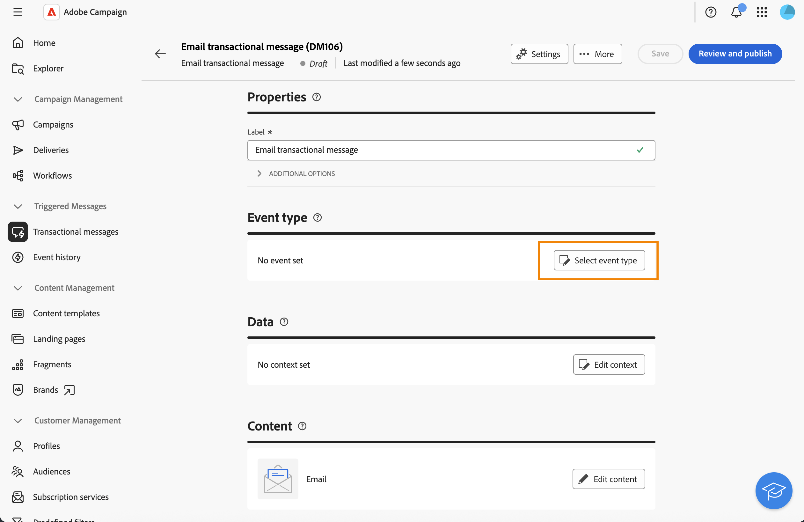
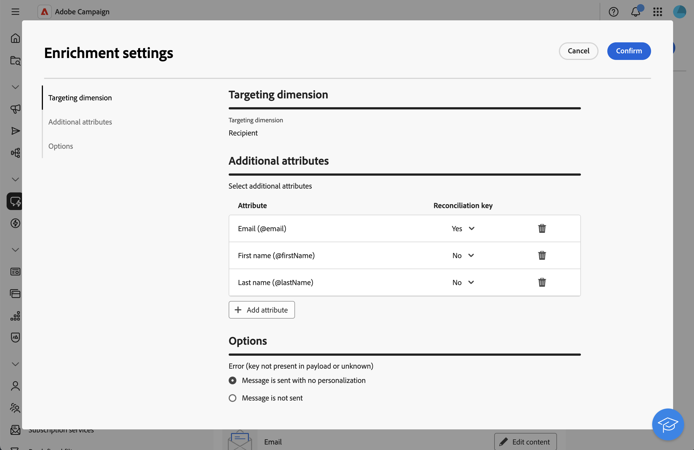

# Förbättra transaktionsmeddelanden med profildata{#profile-enrichment}

>[!CONTEXTUALHELP]
>id="acw_homepage_welcome_rn2"
>title="Profilberikning"
>abstract="Nu kan ni personalisera transaktionsmeddelanden genom att länka fält i Campaign-databasen till innehåll. Välj målmappningar, berikande kolumner och avstämningsnycklar för korrekt personalisering i realtid."
>additional-url="https://experienceleague.adobe.com/docs/campaign-web/v8/release-notes/release-notes.html" text="Se versionsinformation"

Med den här funktionen kan du anpassa transaktionsmeddelanden genom att länka Adobe Campaign-databasfält till meddelandeinnehåll. Du kan välja målmappningar, berikningskolumner och en avstämningsnyckel för att säkerställa korrekt personalisering i realtid samtidigt som prestandatrösklar bibehålls.

* Händelsebaserade transaktionsmeddelanden använder data som finns i själva händelsen.
* Profilbaserade transaktionsmeddelanden använder data som finns i Adobe Campaign-databasen.

Så här ställer du in profilberikning:

1. Skapa transaktionsmeddelandet, [läs mer](#create-enrichment)
1. Definiera händelsetypen, [läs mer](#event-enrichment)
1. Ställ in anrikningsinställningarna, [läs mer](#settings-enrichment)
1. Definiera innehållet, [läs mer](#content-enrichment)
1. Validera och skicka, [läs mer](#send-enrichment)

>[!NOTE]
>
>Servern måste uppgraderas till 8.8.2 eller senare.
>
>Den här funktionen är för närvarande endast tillgänglig för e-post, SMS och push-meddelanden.

## Skapa transaktionsmeddelandet{#create-enrichment}

Först måste du skapa ett nytt transaktionsmeddelande.

1. Gå till **[!UICONTROL Triggered messages]** i avsnittet **[!UICONTROL Transactional messages]** och skapa ett nytt transaktionsmeddelande.

   {zoomable="yes"}

1. Välj en mall och definiera egenskaperna. Se denna [sida](create-transactional.md#transactional-message) för mer information om detta.

## Definiera händelsetypen{#event-enrichment}

Sedan måste du definiera händelsen som profilbaserad på måldata i Adobe Campaign-databasen.

1. I avsnittet **Händelsetyp** väljer du **Välj händelsetyp** och sedan om du vill använda en befintlig händelsetyp eller skapa en egen.

   >[!NOTE]
   >
   >Du kan inte välja en händelsetyp som redan används i en annan transaktionsmeddelandemall.

   {zoomable="yes"}

1. Ange information om händelsetyp:

   * För en befintlig händelsetyp väljer du den i listan.
   * Lägg till en etikett och ett namn för en ny.

1. Välj sedan **Profil-RT** i listrutan **Händelsetyp**.

   {zoomable="yes"}

## Ställ in anrikningsinställningar{#settings-enrichment}

Låt oss nu lägga till fält till händelsen som gör att du kan anpassa transaktionsmeddelandet.

1. Klicka på **Inställningar för** i avsnittet **Data**.

   {zoomable="yes"}

   >[!NOTE]
   >
   >Den här knappen är bara tillgänglig när du definierar en profilbaserad händelse.

1. Klicka på **Lägg till attribut** i avsnittet **Ytterligare attribut** och markera de fält som behövs.

   {zoomable="yes"}

1. Definiera vilket attribut som ska användas som avstämningsnyckel.

1. Välj vad som ska hända om nyckeln inte är tillgänglig i nyttolasten.

   * Meddelandet skickas utan någon personalisering
   * Meddelandet har inte skickats

## Definiera innehållet{#content-enrichment}

Sedan måste du definiera innehållet i transaktionsmeddelandet.

1. Klicka på knappen **Redigera innehåll** i avsnittet **Innehåll** och definiera meddelandeinnehållet. Se den här [sidan](create-transactional.md#transactional-content).

   {zoomable="yes"}

1. När du använder personalisering kan du t.ex. använda menyn **Profilberikning** på ämnesraden för att lägga till de profilbaserade fält som tidigare definierats.

   {zoomable="yes"}

## Validera och skicka{#send-enrichment}

Slutligen måste ni validera och skicka leveransen.

1. Validera leveransen genom att simulera innehållet och skicka korrektur. Se den här [sidan](validate-transactional.md).

1. Klicka på knappen **[!UICONTROL Review and publish]** för att skapa och publicera meddelandet. Utlösarna kan nu initiera att ditt transaktionsmeddelande skickas.

<!--
When creating the event configuration, select the Profile event targeting dimension (see Creating an event).

Add fields to the event, in order to be able to personalize the transactional message (see Defining the event attributes). You must add at least one field to create an enrichment. You do not need to create other fields such as First name and Last name as you will be able to use personalization fields from the Adobe Campaign database.

Create an enrichment in order to link the event to the Profile resource (see Enriching the event) and select this enrichment as the Targeting enrichment.

IMPORTANT
This step is mandatory for profile-based events.
Preview and publish the event (see Previewing and publishing the event).

When previewing the event, the REST API does not contain an attribute specifying the email address, mobile phone, or push notification specific attributes, as it will be retrieved from the Profile resource.

Once the event has been published, a transactional message linked to the new event is automatically created. In order for the event to trigger sending a transactional message, you must modify and publish the message that was just created…

Integrate the event into your website (see Integrate the event triggering).
-->
