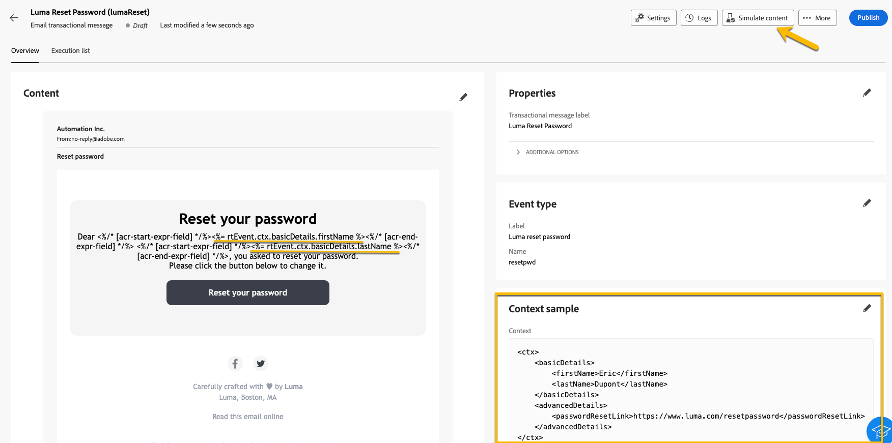

# Validera transaktionsmeddelanden

Under eller efter att du har skapat ditt transaktionsmeddelande kanske du vill validera innehållet med hjälp av ett dataexempel.

## Simulera innehåll {#simulate-content}

Följ de här stegen för att simulera innehållet i ditt meddelande:

* Kontrollera att personaliseringssökvägen i meddelandeinnehållet matchar ditt kontextexempel. I exemplet nedan använder du sökvägen *rtEvent.ctx.basicDetails.firstName* för att visa testprofilens förnamn.

  Du kan ändra meddelandeinnehållet eller kontextexemplet så att de justeras.

  {zoomable="yes"}

* Klicka på knappen **[!UICONTROL Simulate content]** om du vill förhandsgranska ditt transaktionsmeddelande med data som har angetts i kontextexemplet.

  {zoomable="yes"}

  När du har granskat ditt innehåll klickar du på knappen **[!UICONTROL Close]**.

* Kontrollera att du klickar på knappen **[!UICONTROL Republish]** om du har gjort några ändringar i innehållet.

## Skicka bevis

Använd korrekturfunktionen om du vill testa och uppleva transaktionsmeddelandet som det skulle ha skickats via den valda kanalen, till exempel e-post, SMS eller push-meddelanden.

Klicka på knappen **[!UICONTROL Send proof]** i fönstret [simuleringsinnehåll](#simulate-content).

{zoomable="yes"}

I det nya fönstret som visas anger du e-postadressen eller telefonnumret, beroende på kanalen, där du vill ha korrekturet. Klicka på knapparna **[!UICONTROL Send proof]** och **[!UICONTROL Confirm]** när du har angett den önskade adressen. Den här åtgärden skickar ett exempel på ditt transaktionsmeddelande och ser till att alla anpassningar, dynamiskt innehåll och formatering visas korrekt som de skulle ha gjort för slutanvändarna.

{zoomable="yes"}

Det här steget är viktigt för att identifiera eventuella problem innan du publicerar ditt transaktionsmeddelande.