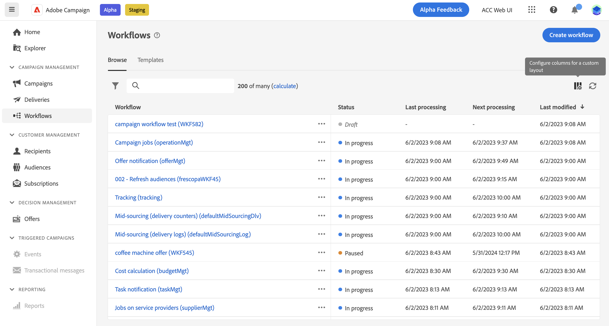

# Få åtkomst till och hantera arbetsflöden {#access-monitor}

>[!CONTEXTUALHELP]
>id="acw_targeting_workflow_list"
>title="Arbetsflöden"
>abstract="På den här skärmen kan du komma åt den fullständiga listan över fristående arbetsflöden och kampanjarbetsflöden, kontrollera deras aktuella status, senaste/nästa körningsdatum och skapa ett nytt arbetsflöde. Bläddra till fliken Mallar för att komma åt tillgängliga arbetsflödesmallar."

The **[!UICONTROL Workflows]** kan du komma åt hela listan med arbetsflöden. Listan innehåller båda **fristående arbetsflöden** som har skapats från den här skärmen, och **kampanjarbetsflöden** som har skapats i en kampanj.

Varje arbetsflöde i listan visar information om dess aktuella [status](#status), senaste gången den kördes eller ändrades samt nästa schemalagda körningsdatum och -tid.

Du kan anpassa de kolumner som visas genom att klicka på **[!UICONTROL Configure column for a custom layout]** -ikonen i det övre högra hörnet av listan. På så sätt kan du lägga till ytterligare information i listan, t.ex. den senaste felaktiviteten för varje arbetsflöde eller den använda måldimensionen.

Dessutom finns det ett sökfält och filter som gör det enklare att söka i listan. Du kan till exempel filtrera arbetsflödena så att de bara visar dem som tillhör en kampanj, eller de som bearbetas under ett visst datumintervall.

Om du vill duplicera eller ta bort ett arbetsflöde klickar du på knappen Ellips och väljer **[!UICONTROL Duplicate]** eller **[!UICONTROL Delete]**.

>[!NOTE]
>
>Du kan duplicera ett pågående arbetsflöde, men du kan inte ta bort det.

## Arbetsflödenas status {#status}

Arbetsflöden kan ha flera statusvärden:

* **[!UICONTROL Draft]**: Arbetsflödet har skapats och sparats.
* **[!UICONTROL In progress]**: Arbetsflödet körs för närvarande.
* **[!UICONTROL Finished]**: Körningen av arbetsflödet är klar.
* **[!UICONTROL Paused]**: Arbetsflödet har pausats.
* **[!UICONTROL Erroneous]**: Ett fel uppstod i arbetsflödet. Öppna arbetsflödet och öppna loggarna och uppgifterna för att identifiera felet och åtgärda det. [Lär dig övervaka loggar och uppgifter](start-monitor-workflows.md#logs-tasks)

Detaljerad information om hur du startar och övervakar arbetsflödet finns i [den här sidan](start-monitor-workflows.md).

## Arbetsflödesmallar {#templates}

The **[!UICONTROL Templates]** På -fliken visas alla tillgängliga arbetsflödesmallar.

Arbetsflödesmallar innehåller förkonfigurerade aktiviteter och övergripande egenskapskonfigurationer som kan återanvändas för att skapa nya arbetsflöden. De skapas från klientkonsolen. [Lär dig arbeta med mallar](https://experienceleague.adobe.com/docs/campaign/automation/workflows/introduction/build-a-workflow.html#workflow-templates)
