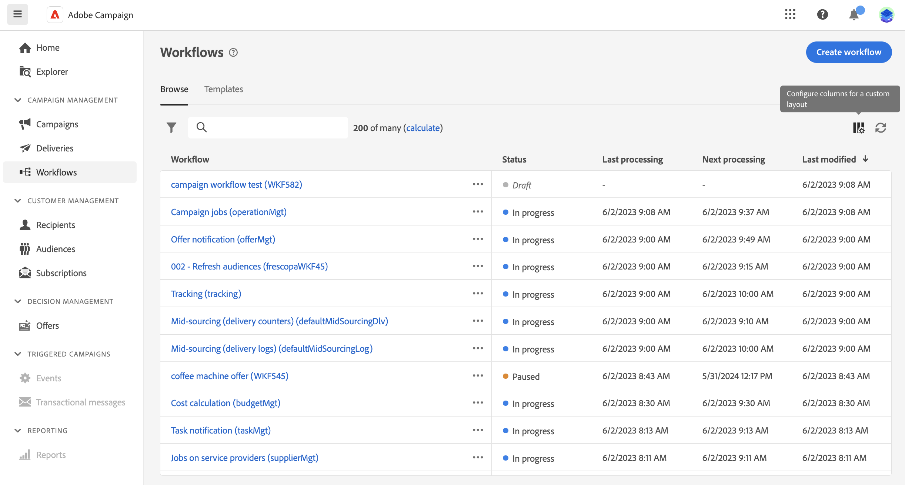

# Få åtkomst till och hantera arbetsflöden {#access-monitor}

>[!CONTEXTUALHELP]
>id="acw_targeting_workflow_list"
>title="Arbetsflöden"
>abstract="På den här skärmen kan du komma åt den fullständiga listan över fristående arbetsflöden och kampanjarbetsflöden, kontrollera deras aktuella status, senaste/nästa körningsdatum och skapa ett nytt arbetsflöde. Bläddra till fliken Mallar för att komma åt tillgängliga arbetsflödesmallar."

Menyn **[!UICONTROL Workflows]** ger åtkomst till den fullständiga listan över arbetsflöden. Den här listan innehåller både **fristående arbetsflöden** som skapats från den här skärmen och **kampanjarbetsflöden** som skapats i en kampanj.

{zoomable="yes"}

Varje arbetsflöde i listan visar information om dess aktuella [status](#status), den senaste gången det kördes eller ändrades samt nästa schemalagda körningsdatum och -tid.

Anpassa de kolumner som visas genom att klicka på ikonen **[!UICONTROL Configure column for a custom layout]** i det övre högra hörnet av listan. På så sätt kan du lägga till ytterligare information i listan, till exempel den senaste felaktiviteten för varje arbetsflöde eller den använda måldimensionen.

Dessutom finns det ett sökfält och filter som förenklar sökningen i listan. Du kan t.ex. filtrera arbetsflöden så att endast de som tillhör en kampanj eller de som bearbetas under ett visst datumintervall visas.

Om du vill duplicera eller ta bort ett arbetsflöde klickar du på ellipsknappen och väljer sedan **[!UICONTROL Duplicate]** eller **[!UICONTROL Delete]**.

>[!NOTE]
>
>Du kan duplicera ett pågående arbetsflöde, men du kan inte ta bort det.

## Arbetsflödenas status {#status}

Arbetsflöden kan ha flera statusvärden:

* **[!UICONTROL Draft]**: Arbetsflödet har skapats och sparats.
* **[!UICONTROL In progress]**: Arbetsflödet körs för närvarande.
* **[!UICONTROL Finished]**: Arbetsflödets körning är slutförd.
* **[!UICONTROL Paused]**: Arbetsflödet har pausats.
* **[!UICONTROL Erroneous]**: Ett fel uppstod i arbetsflödet. Öppna arbetsflödet och öppna loggarna och uppgifterna för att identifiera felet och åtgärda det. [Lär dig övervaka loggar och uppgifter](start-monitor-workflows.md#logs-tasks)

Detaljerad information om hur du startar och övervakar arbetsflödeskörning finns på [den här sidan](start-monitor-workflows.md).

## Arbetsflödesmallar {#templates}

Fliken **[!UICONTROL Templates]** visar alla tillgängliga arbetsflödesmallar.

Arbetsflödesmallar innehåller förkonfigurerade aktiviteter och övergripande egenskapskonfigurationer som kan återanvändas för att skapa nya arbetsflöden.

Skapa arbetsflödesmallar från ett befintligt arbetsflöde eller från grunden. [Lär dig skapa arbetsflödesmallar](create-workflow.md#workflow-templates)