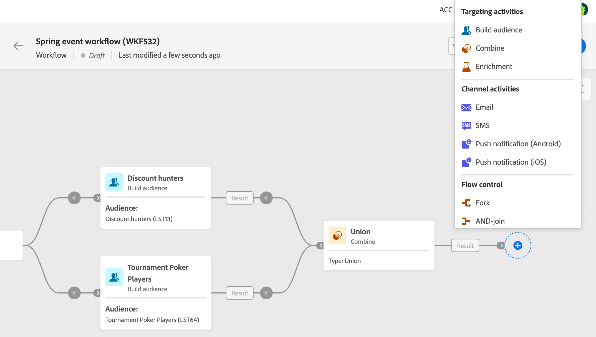

# Om arbetsflödesaktiviteter {#workflow-activities}

Arbetsflödesaktiviteter grupperas i tre kategorier. Beroende på sammanhanget kan tillgängliga aktiviteter variera.

Alla aktiviteter beskrivs i avsnitten nedan:

* [Verksamheter som riktar sig till](#targeting)
* [Kanalaktiviteter](#channel)
* [Flödeskontroll](#flow-control)

## Verksamheter som riktar sig till {#targeting}

Dessa aktiviteter är specifika för målgruppsanpassning, ändring och berikning av populationsdata. Med dem kan du skapa ett eller flera mål genom att definiera en målgrupp och dela eller kombinera dessa målgrupper med hjälp av skärnings-, union- eller uteslutningsåtgärder.

* The [Spara målgrupper](save-audience.md) kan du uppdatera en befintlig målgrupp eller skapa en ny målgrupp utifrån den population som beräknas uppströms i ett arbetsflöde.
* The [Bygg målgrupper](build-audience.md) kan du definiera målpopulationen. Du kan antingen välja en befintlig målgrupp eller använda regelbyggaren för att definiera en egen fråga.
* The [Kombinera](combine.md) kan segmentera den inkommande populationen. Du kan använda en union, en skärning eller ett undantag.
* The [Dela](split.md) kan du segmentera inkommande population i flera deluppsättningar.
* The [Berikning](enrichment.md) kan du definiera ytterligare data som ska bearbetas i arbetsflödet. Med den här aktiviteten kan du utnyttja den inkommande övergången och konfigurera aktiviteten för att slutföra utdataövergången med ytterligare data.
* The [Deduplicering](deduplication.md) kan du ta bort dubbletter i resultatet av inkommande aktiviteter.
* The [Ändra dimension](change-dimension.md) kan du ändra målinriktningsdimensionen när du skapar arbetsflödet.

## Kanalaktiviteter {#channel}

Med Adobe Campaign Web kan ni automatisera och köra marknadsföringskampanjer i flera kanaler, som e-post, SMS eller push. Du kan kombinera kanalaktiviteter på arbetsytan för att skapa flerkanaliga arbetsflöden som kan utlösa åtgärder baserat på kundbeteende.

Följande **Kanal** aktiviteter är tillgängliga:

* E-post
* Push
* SMS

Se detta [section](channels.md).

## Flödeskontroll {#flow-control}

>[!CONTEXTUALHELP]
>id="acw_orchestration_end"
>title="Avsluta aktivitet"
>abstract="The **End** kan du grafiskt markera slutet av ett arbetsflöde. Denna aktivitet har ingen funktionell inverkan och är därför frivillig."

Följande aktiviteter är specifika för att organisera och köra arbetsflöden. Deras huvuduppgift är att samordna de övriga verksamheterna:

* The [Schemaläggare](scheduler.md) kan du schemalägga när arbetsflödet börjar.
* The [Och-join](and-join.md) kan du synkronisera flera körningsgrenar i ett arbetsflöde.
* The **End** kan du grafiskt markera slutet av ett arbetsflöde. Denna aktivitet har ingen funktionell inverkan och är därför frivillig.
* The [Gaffel](fork.md) kan du skapa utgående övergångar och starta flera aktiviteter samtidigt.
* The [Vänta](wait.md) aktiviteten tillfälligt avbryter körningen av en del av ett arbetsflöde.

<!--
## Data management activities {#data-management}

overview: what they're used for
which use case you can perform with them

list available activites + short description + ref to section
-->

