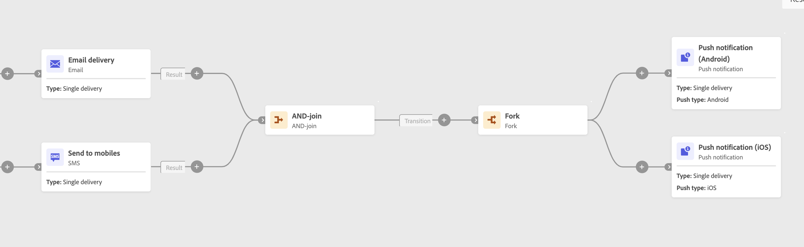

# AND-join {#join}

The **Och-join** kan du synkronisera flera körningsgrenar i ett arbetsflöde.

AND-join-aktiviteten utlöser endast sin utgående övergång när alla inkommande övergångar har aktiverats, det vill säga när alla föregående aktiviteter har slutförts.

## Konfiguration

Följ de här stegen för att konfigurera **AND-join** aktivitet:

1. Lägg till flera aktiviteter som **Kombinera** aktiviteter för att bilda minst två olika utförandegrenar.
1. Lägg till en **AND-join** till någon av grenarna.
1. I **Sammanfogningsalternativ** markerar du alla tidigare aktiviteter du vill delta i.
1. Välj **Primär uppsättning** som ska behållas i den utgående övergången.

## Exempel

I följande exempel visas två arbetsflödesgrenar med e-post och SMS-leverans. AND-join utlöses när båda inkommande övergångar är aktiverade. Push-meddelandena skickas sedan först när båda leveranserna är klara.

