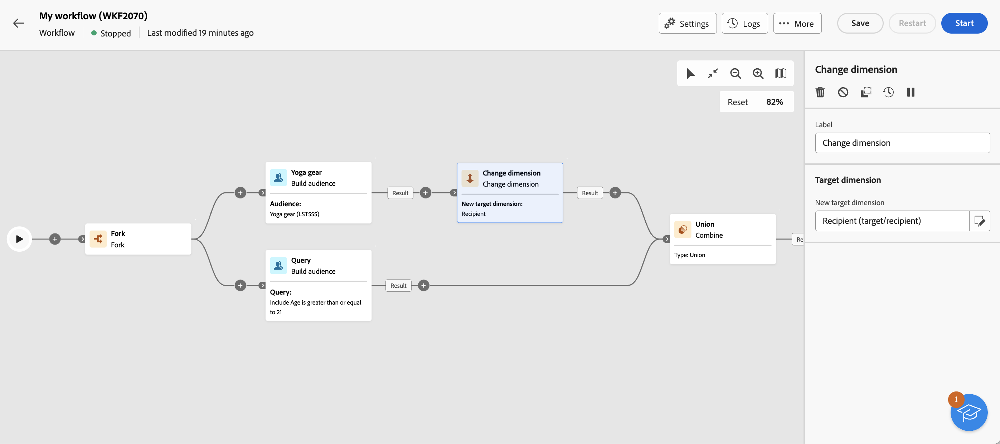

# Bygg målgrupper {#build-audience}

>[!CONTEXTUALHELP]
>id="acw_orchestration_build_audience"
>title="Bygg målgruppsaktivitet"
>abstract="The **Bygg målgrupper** kan du definiera målgruppen som ska delta i arbetsflödet. När du skickar meddelanden i ett arbetsflödes sammanhang definieras inte meddelandemålgruppen i kanalaktiviteten, utan i **Bygg målgrupper** aktivitet."

The **Bygg målgrupper** aktiviteten är en **Målinriktning** aktivitet. Med den här aktiviteten kan du definiera målgruppen som ska delta i arbetsflödet. När du skickar meddelanden i ett arbetsflödes sammanhang definieras inte meddelandemålgruppen i kanalaktiviteten, utan i **Bygg målgrupper** aktivitet.

Om du vill definiera målgruppspopulationen kan du:

* Välj en befintlig målgrupp som skapats som en lista i klientkonsolen.
* Välj en Adobe Experience Platform-målgrupp.
* Bygg en ny målgrupp med regelbyggaren genom att definiera och kombinera filtervillkor.

>[!NOTE]
>
>I det här sammanhanget kan du inte läsa in en målgrupp från en fil. Därför måste du skapa en fristående e-postleverans. [Läs mer](../../audience/about-recipients.md)

<!--
The **Build audience** activity can be placed at the beginning of the workflow or after any other activity. Any activity can be placed after the **Build audience**.
-->

## Konfigurera aktiviteten Skapa målgrupp{#build-audience-configuration}

>[!CONTEXTUALHELP]
>id="acw_orchestration_build_audience_dimension"
>title="Välj måldimension"
>abstract="Med målinriktningsdimensionen kan du definiera målgruppen för operationen: mottagare, mottagare, operatör, prenumeranter osv. Som standard är målet markerat bland mottagarna."

Följ de här stegen för att konfigurera **Bygg målgrupper** aktivitet:

1. Lägg till en **Bygg målgrupper** aktivitet.
1. Definiera en etikett.
1. Definiera målgruppstyp: **Skapa en egen** eller **Läsa målgrupper**.

Så här skapar du en egen fråga:

1. Välj **Skapa en egen (fråga)**.
1. Välj **Måldimension**. Med målinriktningsdimensionen kan du definiera målgruppen för operationen: mottagare, mottagare, operatör, prenumeranter osv. Som standard är målet markerat bland mottagarna. Läs mer om Målinställningar i [det här avsnittet](../../audience/about-recipients.md#targeting-dimensions).
1. Klicka **Fortsätt**.
1. Använd regelbyggaren för att definiera frågan, på samma sätt som du skapar en målgrupp när du utformar ett nytt e-postmeddelande. Se detta [section](../../audience/segment-builder.md).

Så här väljer du en befintlig målgrupp:

1. Välj **Läsa målgrupper**.
1. Klicka **Fortsätt**.
1. Välj målgrupp på samma sätt som du använder en målgrupp när du utformar ett nytt e-postmeddelande. Se detta [section](../../audience/add-audience.md).

>[!IMPORTANT]
>
>Om du vill använda en **[!UICONTROL Build audience]** målgruppsanpassning för Experience Platform måste du lägga till en **[!UICONTROL Change dimension]** för att säkerställa att målgruppens målinriktning är inställd på&quot;Mottagare&quot;. Ett arbetsflödesexempel finns längst ned på den här sidan.

## Exempel{#build-audience-examples}

Här är ett exempel på ett arbetsflöde med två **Bygg målgrupper** verksamhet. Det första riktar sig till pokerspelarna, följt av ett mejlerbjudande. Det andra riktar sig till VIP kunder, följt av en SMS-leverans.

Här är ett exempel på ett arbetsflöde där en Adobe Experience Platform-publik kombineras med en Adobe Campaign-målgrupp. Om du vill att dessa målgrupper ska kunna kombineras kan du **[!UICONTROL Change dimension]** med målgruppsdimensionen&quot;Mottagare&quot; läggs till efter Adobe Experience Platform målgrupp. [Lär dig hur du konfigurerar en Ändra dimensionsaktivitet](change-dimension.md)

