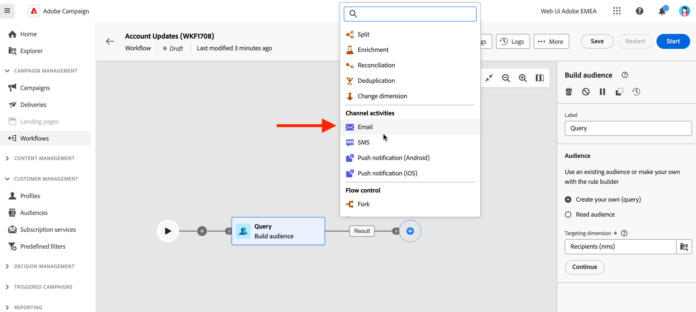
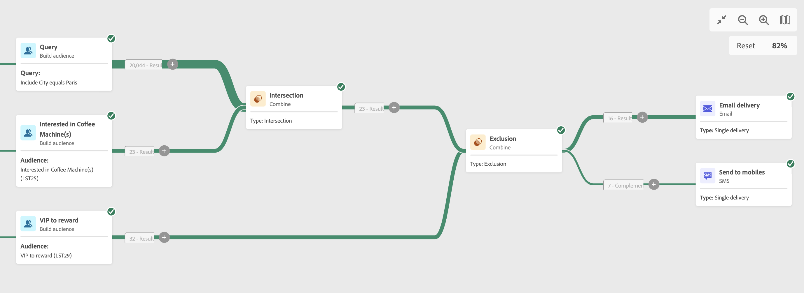

# E-post, SMS, push-aktiviteter {#channel}

Med Adobe Campaign Web kan ni automatisera och genomföra marknadsföringskampanjer i alla e-post-, SMS- och push-kanaler. Du kan kombinera kanalaktiviteter i arbetsytan för arbetsflöden för att skapa flerkanaliga arbetsflöden som kan utlösa åtgärder baserat på kundbeteende och data.

Du kan till exempel skapa en välkomstkampanj för e-post som innehåller en serie meddelanden i olika kanaler, som e-post, SMS och push. Du kan också skicka ett uppföljningsmeddelande via e-post när en kund har slutfört ett köp eller skicka ett personligt födelsedagmeddelande till en kund via SMS.

Genom att använda kanalaktiviteter kan ni skapa omfattande och personaliserade kampanjer som engagerar kunder över flera kontaktytor och driver konverteringar.

>[!NOTE]
>
>Du kan också skapa en engångsleverans, utanför ramen för ett kampanjarbetsflöde. Läs mer i följande avsnitt:
>* [Skapa fristående e-postleverans](../../email/create-email.md)
>* [Skapa fristående SMS-leverans](../../sms/create-sms.md)
>* [Skapa fristående push-leverans](../../push/create-push.md)

## Bygg upp arbetsflödet{#build-your-workflow}

Börja bygga arbetsflödet med relevanta aktiviteter innan du monterar leveransen:

* Om du vill skicka en återkommande leverans startar du arbetsflödet med en **Schemaläggare** aktivitet. Om du vill skicka en enstaka leverans kan du definiera kontaktdatum med en **Schemaläggare** aktiviteten eller definiera schemat i leveransinställningarna. Se [det här avsnittet](scheduler.md).

* Lägg till en **Bygg målgrupper** aktivitet. Målgruppen är huvudmålet för leveransen: mottagarna som tar emot meddelandena. När du skickar meddelanden i ett kampanjarbetsflöde definieras inte meddelandemålgruppen i kanalaktiviteten, utan i **Bygg målgrupper** aktivitet. Se [det här avsnittet](build-audience.md).

  

## Konfigurera kanalaktiviteten {#create-a-delivery-in-a-workflow}

>[!CONTEXTUALHELP]
>id="acw_orchestration_email"
>title="E-postaktivitet"
>abstract="E-postaktiviteten underlättar e-postutskick i ditt arbetsflöde och gör det möjligt att skicka både enstaka och återkommande meddelanden. Den automatiserar processen för att skicka e-post till ett mål som beräknas inom samma arbetsflöde. Du kan kombinera kanalaktiviteter i arbetsytan för arbetsflöden för att skapa flerkanaliga arbetsflöden som kan utlösa åtgärder baserat på kundbeteende och data."

>[!CONTEXTUALHELP]
>id="acw_orchestration_sms"
>title="SMS-aktivitet"
>abstract="SMS-aktiviteten underlättar SMS-utskick inom ditt arbetsflöde och gör det möjligt att skicka både engångs- och återkommande meddelanden. Den automatiserar processen för att skicka SMS till ett mål som beräknas inom samma arbetsflöde. Du kan kombinera kanalaktiviteter i arbetsytan för arbetsflöden för att skapa flerkanaliga arbetsflöden som kan utlösa åtgärder baserat på kundbeteende och data."

>[!CONTEXTUALHELP]
>id="acw_orchestration_push_ios"
>title="Push iOS activity"
>abstract="Push iOS-aktiviteten effektiviserar processen att skicka iOS Push-meddelanden som en del av ditt arbetsflöde. Det gör det möjligt att leverera både engångs- och återkommande meddelanden, och automatiserar utskicksmeddelandena från iOS Push till ett fördefinierat mål inom samma arbetsflöde. Du kan kombinera kanalaktiviteter i arbetsytan för arbetsflöden för att skapa flerkanaliga arbetsflöden som kan utlösa åtgärder baserat på kundbeteende och data."

>[!CONTEXTUALHELP]
>id="acw_orchestration_push_android"
>title="Push Android-aktivitet"
>abstract="Aktiviteten Push Android effektiviserar processen att skicka push-meddelanden för Android som en del av ditt arbetsflöde. Det gör det möjligt att leverera både engångs- och återkommande meddelanden, och automatiserar skickade Android-push-meddelanden till ett fördefinierat mål inom samma arbetsflöde. Du kan kombinera kanalaktiviteter i arbetsytan för arbetsflöden för att skapa flerkanaliga arbetsflöden som kan utlösa åtgärder baserat på kundbeteende och data."

Följ stegen nedan för att konfigurera en leverans i ett arbetsflödes sammanhang:

1. Lägg till en kanalaktivitet: **[!UICONTROL Email]**, **[!UICONTROL SMS]**, **[!UICONTROL Push notification (Android)]** eller **[!UICONTROL Push notification (iOS)]**.

1. Välj **Typ av leverans**: enkel eller återkommande.

   * **Enskild leverans**: det här är en engångsleverans, som bara skickas en gång, till exempel ett e-postmeddelande från Black Friday.
   * **Återkommande leverans**: för den här typen av leverans ställer du in körningsfrekvensen med en [schemaläggaraktivitet](scheduler.md). Varje gång arbetsflödet körs beräknas målgruppen om och leveransen skickas med det uppdaterade innehållet. Det här kan vara ett veckonyhetsbrev eller ett återkommande födelsedagskalender.

1. Välj en leverans **Mall**. Mallar är förkonfigurerade leveransinställningar som är specifika för en kanal. En inbyggd mall är tillgänglig för varje kanal och förfylld som standard. [Läs mer](../../msg/delivery-template.md)

   

   Du kan välja en annan mall i den vänstra rutan för kanalaktivitetskonfigurationen. Om den tidigare valda publiken inte är kompatibel med kanalen kan du inte välja en mall. Du löser detta genom att uppdatera **Bygg målgrupper** för att välja en målgrupp med rätt målmappning. Läs mer om målmappningar i [Adobe Campaign v8-dokumentation (klientkonsol)](https://experienceleague.adobe.com/docs/campaign/campaign-v8/audience/add-profiles/target-mappings.html){target="_blank"}.

1. Klicka **Skapa leverans**. Definiera meddelandeinställningar och innehåll på samma sätt som du skapar en fristående leverans. Du kan också schemalägga och simulera innehållet. [Läs mer](../../msg/gs-messages.md).

1. Gå tillbaka till arbetsflödet. Välj om du vill fortsätta med arbetsflödet **Generera en utgående övergång** om du vill lägga till en övergång efter kanalaktiviteten.

1. Klicka **Starta** för att starta arbetsflödet.

   Som standard utlöses meddelandeförberedelsefasen när ett arbetsflöde startas, utan att meddelandet skickas omedelbart.

1. Öppna leveransaktiviteten och bekräfta sändningen från **Granska och skicka** -knappen.

1. Klicka på **Skicka**.

## Exempel {#cross-channel-workflow-sample}

Här är ett exempel på flerkanaligt arbetsflöde med segmentering och två leveranser. Arbetsflödet riktar sig till alla kunder som bor i Paris och som är intresserade av kaffemaskiner. Bland de här befolkningsgrupperna skickas ett e-postmeddelande till de vanliga kunderna och ett SMS skickas till de VIP klienterna.

<!--
description, which use case you can perform (common other activities that you can link before of after the activity)

how to add and configure the activity

example of a configured activity within a workflow
The Email delivery activity allows you to configure the sending an email in a workflow. 

-->

Du kan också skapa ett återkommande arbetsflöde för att skicka ett personaliserat SMS varje dag i månaden kl. 20.00 till alla kunder i Paris.

<!-- Scheduled emails available?

This can be a single send email and sent just once, or it can be a recurring email.
* Single send emails are standard emails, sent once.
* Recurring emails allow you to send the same email multiple times to different targets over a defined period. You can aggregate the deliveries per period in order to get reports that correspond to your needs.

When linked to a scheduler, you can define recurring emails.
Email recipients are defined upstream of the activity in the same workflow, via an Audience targeting activity.

-->

<!--The message preparation is triggered according to the workflow execution parameters. From the message dashboard, you can select whether to request or not a manual confirmation to send the message (required by default). You can start the workflow manually or place a scheduler activity in the workflow to automate execution.-->
