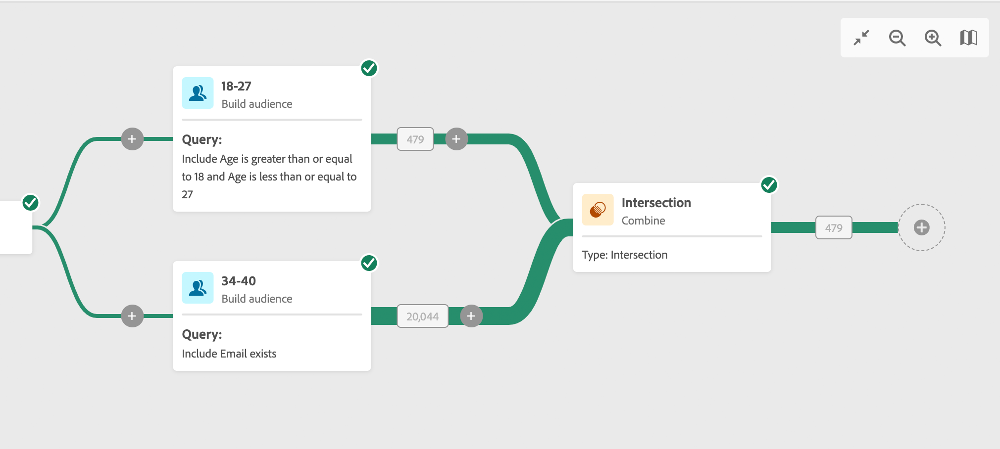

# Kombinera {#combine}

The **Kombinera** aktiviteten är en **Målinriktning** aktivitet. Med den här aktiviteten kan du segmentera den inkommande populationen. Du kan alltså kombinera flera populationer, utesluta en del av dem eller bara behålla data som är gemensamma för flera mål. Här är de tillgängliga segmenteringstyperna:

<!--
The **Combine** activity can be placed after any other activity, but not at the beginning of the workflow. Any activity can be placed after the **Combine**.
-->

* The **Union** gör att du kan gruppera om resultatet av flera aktiviteter till ett enda mål.
* The **Skärningspunkt** gör att du bara kan behålla de element som är gemensamma för de olika inkommande populationerna i aktiviteten.
* The **Uteslutning** gör att du kan utesluta element från en population enligt vissa kriterier.

## Allmän konfiguration {#general}

>[!CONTEXTUALHELP]
>id="acw_orchestration_intersection_merging_options"
>title="Sammanfogningsalternativ för skärningar"
>abstract="Med skärningspunkten kan du bara behålla de element som är gemensamma för de olika inkommande populationerna i aktiviteten. Markera alla tidigare aktiviteter som du vill ansluta till i sektionen Uppsättningar att ansluta."

>[!CONTEXTUALHELP]
>id="acw_orchestration_exclusion_merging_options"
>title="Alternativ för uteslutningssammanslagning"
>abstract="Med det här undantaget kan du utesluta element från en population enligt vissa kriterier. Markera alla tidigare aktiviteter som du vill ansluta till i sektionen Uppsättningar att ansluta."

Följ de här vanliga stegen för att börja konfigurera **Kombinera** aktivitet:

1. Lägg till flera aktiviteter som **Bygg målgrupper** aktiviteter för att bilda minst två olika utförandegrenar.
1. Lägg till en **Kombinera** verksamhet till någon av de tidigare filialerna.
1. Välj segmenteringstyp: [union](#union), [skärningspunkt](#intersection) eller [exkludering](#exclusion).
1. Klicka **Fortsätt**.
1. I **Uppsättningar att förena** markerar du alla tidigare aktiviteter du vill delta i.

## Sammanslutning {#union}

>[!CONTEXTUALHELP]
>id="acw_orchestration_intersection_reconciliation_options"
>title="Skärningspunkt avstämningsalternativ"
>abstract="Välj avstämningstypen för att definiera hur dubbletter hanteras."

I **Kombinera** -aktivitet kan du konfigurera en **Union**. För detta måste du välja **Avstämningstyp** för att definiera hur dubbletter hanteras:

* **Endast tangenter**: det här är standardläget. Aktiviteten behåller endast ett element när element från olika inkommande övergångar har samma nyckel.  Detta alternativ kan endast användas om de inkommande populationerna är homogena.
* **En markering med kolumner**: välj det här alternativet för att definiera listan med kolumner som datavstämningen ska användas på. Du måste först markera den primära uppsättningen (som innehåller källdata) och sedan de kolumner som ska användas för kopplingen.

## Skärningspunkt {#intersection}

I **Kombinera** -aktivitet kan du konfigurera en **Skärningspunkt**. För detta behöver du följa de extra stegen nedan:

1. Välj **Avstämningstyp** för att definiera hur dubbletter hanteras. Se [Union](#union) -avsnitt.
1. Du kan kontrollera **Generera slutförande** om du vill bearbeta den återstående populationen. Komplementet ska innehålla en kombination av resultaten av alla inkommande aktiviteter minus skärningspunkten. En ytterligare utgående övergång läggs sedan till i aktiviteten.

## Uteslutning {#exclusion}

>[!CONTEXTUALHELP]
>id="acw_orchestration_exclusion_options"
>title="Uteslutningsregler"
>abstract="Vid behov kan du ändra inkommande tabeller. För att utesluta ett mål från en annan dimension måste detta mål återställas till samma måldimension som huvudmålet. Det gör du genom att klicka på Lägg till en regel i avsnittet Uteslutningsregler och ange villkoren för dimensionsändring. Datavstämning utförs antingen via ett attribut eller en koppling."

I **Kombinera** -aktivitet kan du konfigurera en **Uteslutning**. För detta behöver du följa de extra stegen nedan:

1. I **Uppsättningar att förena** väljer du **Primär uppsättning** från inkommande övergångar. Detta är den uppsättning från vilken element utesluts. De andra uppsättningarna matchar element innan de utesluts från den primära uppsättningen.
1. Vid behov kan du ändra inkommande tabeller. För att utesluta ett mål från en annan dimension måste detta mål återställas till samma måldimension som huvudmålet. Det gör du genom att klicka **Lägg till en regel** i **Uteslutningsregler** och ange villkoren för dimensionsändring. Datavstämning utförs antingen via ett attribut eller en koppling.
1. Du kan kontrollera **Generera slutförande** om du vill bearbeta den återstående populationen. Se [Skärningspunkt](#intersection) -avsnitt.

## Exempel

I följande exempel använder vi en **Kombinera** aktivitet och vi lägger till en **union** för att hämta alla profiler från de två frågorna: personer mellan 18 och 27 år och personer mellan 34 och 40 år.

I följande exempel visas **skärningspunkt** mellan två frågeaktiviteter. Den används här för att hämta profiler som är mellan 18 och 27 år gamla och vars e-postadress har angetts.

Följande **exkludering** I exemplet visas två frågor som har konfigurerats för att filtrera profiler som är mellan 18 och 27 år gamla och som har en Adobe-e-postdomän. Profilerna med en Adobe-e-postdomän exkluderas sedan från den första uppsättningen.

