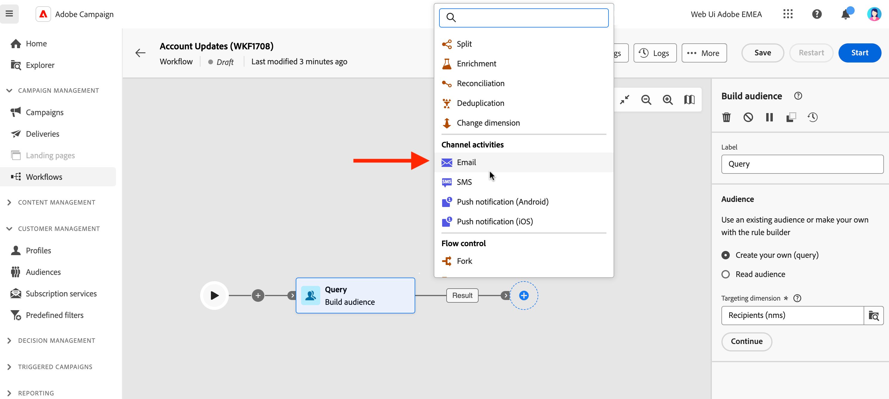

# E-post, SMS, push {#channel}

Med Adobe Campaign Web kan ni automatisera och köra marknadsföringskampanjer i flera kanaler, som e-post, SMS eller push. Du kan kombinera kanalaktiviteter på arbetsytan för att skapa flerkanaliga arbetsflöden som kan utlösa åtgärder baserat på kundbeteende.

Du kan till exempel skapa en välkomstkampanj för e-post som innehåller en serie meddelanden i olika kanaler, som e-post, SMS och push. Du kan också skicka ett uppföljningsmeddelande via e-post när en kund har slutfört ett köp eller skicka ett personligt födelsedagsmeddelande till en kund via SMS.

Genom att använda kanalaktiviteter kan ni skapa omfattande och personaliserade kampanjer som engagerar kunder över flera kontaktytor och driver konverteringar.

Här är stegen som du lägger till **Kanal** aktivitet i ett arbetsflöde:

1. Kontrollera att du har lagt till en **Bygg målgrupper** aktivitet. Målgruppen är er leverans: de mottagare som tar emot meddelandena. När du skickar meddelanden i ett kampanjarbetsflöde definieras inte meddelandemålgruppen i kanalaktiviteten, utan i **Bygg målgrupper** aktivitet. Se [det här avsnittet](build-audience.md).

   

1. Välj en leveransaktivitet: **[!UICONTROL Email]**, **[!UICONTROL SMS]**, **[!UICONTROL Push notification (Android)]** eller **[!UICONTROL Push notification (iOS)]**.

1. Välj en **Mall**. Mallar är förkonfigurerade leveransinställningar som sparas för framtida bruk. [Läs mer](../../msg/delivery-template.md)

1. Klicka **Skapa leverans** och definiera meddelandet på samma sätt som du skapar en fristående leverans. Här definierar du också leveransinställningar, schemaläggning och simulering av innehållet. [Läs mer](../../msg/gs-messages.md)

1. Navigera tillbaka till arbetsflödet och klicka **Starta** för att starta arbetsflödet.

   Som standard utlöses meddelandeförberedelsefasen när ett leveransarbetsflöde initieras, utan att meddelandet skickas omedelbart.

1. Klicka **Granska och skicka** från kanalaktiviteten för att bekräfta sändningen.

1. Klicka på **Skicka**.

## Exempel

Här är ett exempel på flerkanaligt arbetsflöde med segmentering och två leveranser. Arbetsflödet riktar sig till alla kunder som har en e-postadress och som är intresserade av kaffemaskiner. Bland de här befolkningsgrupperna skickas ett e-postmeddelande till de vanliga kunderna och ett SMS skickas till de VIP klienterna.

<!--
description, which use case you can perform (common other activities that you can link before of after the activity)

how to add and configure the activity

example of a configured activity within a workflow
The Email delivery activity allows you to configure the sending an email in a workflow. 

-->

<!-- Scheduled emails available?

This can be a single send email and sent just once, or it can be a recurring email.
* Single send emails are standard emails, sent once.
* Recurring emails allow you to send the same email multiple times to different targets over a defined period. You can aggregate the deliveries per period in order to get reports that correspond to your needs.

When linked to a scheduler, you can define recurring emails.-->

E-postmottagare definieras uppströms aktiviteten i samma arbetsflöde, via en målgruppsaktivitet.

<!--The message preparation is triggered according to the workflow execution parameters. From the message dashboard, you can select whether to request or not a manual confirmation to send the message (required by default). You can start the workflow manually or place a scheduler activity in the workflow to automate execution.-->
