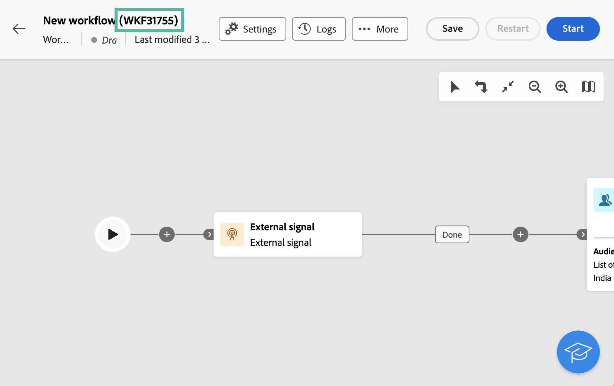

# Extern signal {#external-signal}

<!--External Signal End-->

>[!CONTEXTUALHELP]
>id="acw_orchestration_externalsignal"
>title="Extern signal"
>abstract="Med aktiviteten **Extern signal** kan du utlösa körningen av ett arbetsflöde från ett annat arbetsflöde eller ett API-anrop."

>[!CONTEXTUALHELP]
>id="acw_orchestration_externalsignal_parameters"
>title="Externa signalparametrar"
>abstract="Externa signalparametrar"

>[!CONTEXTUALHELP]
>id="acw_orchestration_end_trigger"
>title="Slututlösare"
>abstract="Slututlösare"

Aktiviteten **Extern signal** är en **Flödeskontroll**-aktivitet. Det gör att du kan utlösa körningen av ett arbetsflöde från ett annat arbetsflöde eller ett API-anrop.

>[!NOTE]
>
>På den här sidan förklaras de viktigaste stegen för att konfigurera en **[!UICONTROL External Signal]**-aktivitet i webbanvändargränssnittet för Campaign och utlösa den från ett annat arbetsflöde eller ett API-anrop. Detaljerad information om hur du utlöser ett arbetsflöde, bästa praxis och hur du arbetar med Campaign-API:er finns i [dokumentationen för Campaign v8 (klientkonsolen)](https://experienceleague.adobe.com/en/docs/campaign/automation/workflows/advanced-management/javascript-in-workflows#trigger-example).

Följ de här stegen för att konfigurera aktiviteten **Extern signal** och utlösa dess körning:

1. Lägg till en **extern signalaktivitet** i arbetsflödet.

1. Slutför konfigurationen av arbetsflödet och starta körningen. Aktiviteten **[!UICONTROL External Signal]** visas som Väntande, väntar på att utlösas.

   

1. Hämta följande information:

   * **Arbetsflödets interna namn**, som visas bredvid dess etikett.

     +++Exempel på vy

     

+++

   * **Den externa signalaktivitetens namn**, som visas i arbetsflödets **[!UICONTROL Execution options]**.

     +++Exempel på vy

     

+++

1. Kör JavaScript-funktionen `PostEvent` om du vill utlösa arbetsflödet. Med den här funktionen kan du skicka variabler med valfria värden och använda dem i det utlösta arbetsflödet.

   Funktionen `PostEvent` kan köras antingen från ett annat arbetsflöde eller från ett API-anrop.

   * Om du vill utlösa en **[!UICONTROL External signal]**-aktivitet från ett arbetsflöde kör du PostEvent-funktionen från rutan **[!UICONTROL Initialization script]** som är tillgänglig från aktivitetens **[!UICONTROL Execution options]**. Kör funktionen från aktivitetens skript för aktiviteten **[!UICONTROL JavaScript code]**.

     Syntaxen är följande:

     ```
     xtk.workflow.PostEvent("<workflow-internal-name>","<signal-activity-name>","",<variables <variable-name>="<value>"/>, false);
     ```

   +++Exempel på vy

   I det här exemplet utlöses den externa signalaktiviteten &quot;signal1&quot;. Den har lagts till i arbetsflödet med det interna namnet&quot;WKF12345&quot;. En variabel med namnet &quot;customID&quot; skickas med värdet &quot;123456&quot;.

   

+++

   * Om du vill utlösa en **[!UICONTROL External signal]**-aktivitet från ett API-anrop följer du stegen som beskrivs i dokumentationen för Campaign API. [Lär dig hur du använder den statiska `PostEvent` method](https://experienceleague.adobe.com/developer/campaign-api/api/sm-workflow-PostEvent.html).