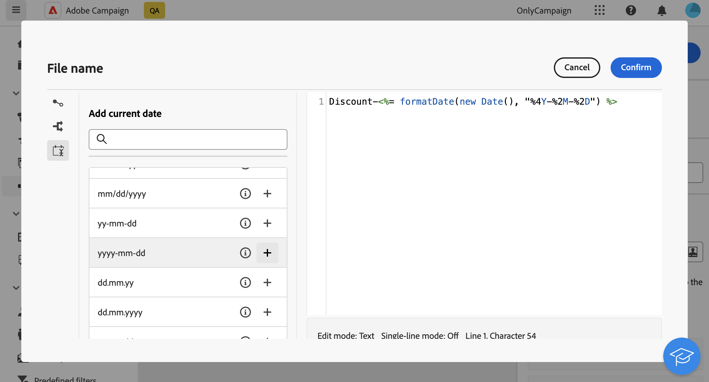

# Extrahera fil {#extract-file}

>[!CONTEXTUALHELP]
>id="acw_orchestration_extractfile"
>title="Extrahera fil"
>abstract="The **Extrahera fil** Med -aktivitet kan du exportera data från Adobe Campaign i form av en extern fil. Data kan sedan exporteras till en serverplats som SFTP, molnlagring eller kampanjservern med hjälp av en överföringsfilaktivitet."

The **Extrahera fil** aktiviteten är en **Datahantering** aktivitet. Använd den här aktiviteten om du vill exportera data från Adobe Campaign i form av en extern fil. Data kan sedan exporteras till en serverplats som SFTP, molnlagring eller kampanjservern med hjälp av en överföringsfilaktivitet.

Konfigurera **Extrahera fil** aktivitet, lägga till **Extrahera fil** följer du stegen nedan.

## Konfigurera filen som ska extraheras {#extract-configuration}

>[!CONTEXTUALHELP]
>id="acw_orchestration_extractfile_file"
>title="Fil att extrahera"
>abstract="Markera den fil som ska extraheras."

The **[!UICONTROL File to extract]** kan du konfigurera filegenskaperna och de data som ska inkluderas.

1. I **[!UICONTROL File name]** anger du önskat namn på filen som ska extraheras.

   Du kan anpassa filens namn med hjälp av händelsevariabler, villkor och datum/tid-funktioner. Klicka på **[!UICONTROL Open personalization dialog]** -ikonen för att öppna uttrycksredigeraren. [Lär dig hur du arbetar med händelsevariabler och uttrycksredigeraren](../event-variables.md)

1. Ange de kolumner som ska finnas i den extraherade filen. Följ dessa steg för att göra detta:

   1. Klicka på **[!UICONTROL Add output column]**.
   1. Välj det attribut som ska visas i kolumnen och bekräfta. Vilka attribut som är tillgängliga beror på arbetsflödets måldimension.
   1. När kolumnen har lagts till kan du ändra dess **[!UICONTROL Label]** och ändra de associerade **[!UICONTROL Attribute]**.
   1. Om du vill använda en omformning på kolumnens värden, markerar du den i listrutan. Du kan till exempel växla alla värden i den markerade kolumnen till versaler.

1. Upprepa dessa steg om du vill lägga till så många kolumner som behövs i extraheringsfilen. Om du vill ändra en kolumns placering använder du upp- och nedpilarna.

1. Om du vill ta bort alla dubblettrader från den extraherade filen aktiverar du **[!UICONTROL Remove duplicate rows(Listing)]** alternativ.

1. Om du vill sortera den extraherade filen baserat på ett attribut, aktiverar du **[!UICONTROL Enable Sorting]** väljer du sedan det attribut som du vill sortera filen efter, tillsammans med önskad sorteringsmetod (stigande eller fallande). Du kan sortera efter vilket attribut som helst från den aktuella måldimensionen, oavsett om det har lagts till i filens kolumner eller inte.

## Konfigurera det extraherade filformatet {#file}

>[!CONTEXTUALHELP]
>id="acw_orchestration_extractfile_destinationformat"
>title="Målformat"
>abstract="Välj de olika alternativen för att konfigurera hur den extraherade filen ska formateras."

The **[!UICONTROL Destination]** I kan du konfigurera hur den extraherade filen ska formateras.

1. Välj **[!UICONTROL Output format]** för den extraherade filen: **Text**, **Text med fast teckenbredd**, **CSV (Excel)** eller **XML**.

1. Klicka på **[!UICONTROL Extraction format]** för att komma åt specifika alternativ för det valda formatet. Expandera avsnittet nedan om du vill ha mer information.

+++ Tillgängliga alternativ för extraheringsformat

   * **[!UICONTROL Use first line as column header]** (Text-/CSV-format (Excel): Aktivera det här alternativet om du vill använda den första kolumnen som rubrik.
   * **[!UICONTROL Column separator]** (Textformat): Ange det tecken som ska användas som kolumnavgränsare i utdatafilen.
   * **[!UICONTROL String delimiter]** (Textformat): Ange hur strängar i utdatafilen ska avgränsas.
   * **[!UICONTROL End of line]** (Textformat): Ange hur radslut i utdatafilen ska avgränsas.
   * **[!UICONTROL Encoding]**: Välj kodning för utdatafilen.
   * **[!UICONTROL Date format and separators]**: Ange hur datum ska formateras i utdatafilen.
   * **[!UICONTROL Number format]**: Ange hur tal ska formateras i utdatafilen.
   * **[!UICONTROL Export labels instead of internal values of enumerations]**: Aktivera det här alternativet om du vill exportera uppräkningsvärden och om du vill hämta kolumnrubriker, som är lättare att förstå, i stället för interna ID:n.

+++

   

## Lägga till ett efterbearbetningsstadium {#script}

>[!CONTEXTUALHELP]
>id="acw_orchestration_extractfile_postprocessing"
>title="Efterbearbetning"
>abstract="Definiera ett steg för efterbearbetning som ska användas, till exempel för komprimering eller kryptering."

The **[!UICONTROL Export modification script]** gör att du kan använda en bearbetningsfas som ska köras under dataextraheringen, t.ex. komprimering eller kryptering. Klicka på **[!UICONTROL Edit script]** -knappen.

Uttrycksredigeraren öppnas och du kan ange det kommando som ska användas för filen. Den vänstra rutan innehåller fördefinierade syntaxer som du kan använda för att skapa skriptet. [Lär dig hur du arbetar med händelsevariabler och uttrycksredigeraren](../event-variables.md)

## Ytterligare alternativ {#additiona-options}

>[!CONTEXTUALHELP]
>id="acw_orchestration_extractfile_outbound"
>title="Utgående övergång"
>abstract="Växla **Generera en utgående övergång** möjlighet att lägga till en utgående övergång efter den aktuella aktiviteten."

>[!CONTEXTUALHELP]
>id="acw_orchestration_extractfile_error"
>title="Processfel"
>abstract="Växla **Processfel** om du vill lägga till en utgående övergång som innehåller fel."

När extraheringen av utdatafilen har konfigurerats finns ytterligare alternativ för övergångar och felhantering:

* **[!UICONTROL Generate outbound transition]**: Aktivera det här alternativet om du vill lägga till en utgående övergång och konfigurera dess etikett.
* **[!UICONTROL Do not generate a file if the inbound transition is empty]**: Aktivera det här alternativet om du vill hoppa över filextraheringen om den inkommande övergången inte innehåller några data.
* **[!UICONTROL Process error]**: Aktivera det här alternativet om du vill lägga till en utgående övergång om något fel inträffar under filextraheringen.

## Exempel {#example}

I följande exempel använder vi en **Bygg målgrupper** aktivitet följd av **Extrahera fil** för att extrahera alla målprofiler till en CSV-fil.

* The **[!UICONTROL File name]** fältet är konfigurerat att inkludera datumet för extraheringen.

  

* Kolumner läggs till för att visa profilernas för- och efternamn, deras kund-ID och datum när de skapades i databasen.

  
