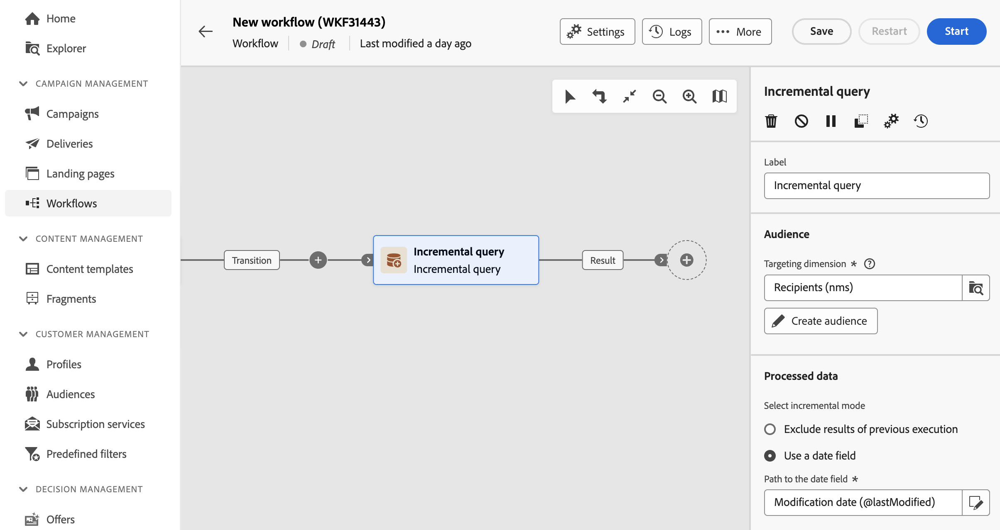

# Inkrementell fråga {#incremental-query}

>[!CONTEXTUALHELP]
>id="acw_orchestration_incrementalquery"
>title="Inkrementell fråga"
>abstract="The **Inkrementell fråga** aktiviteten är en **Målinriktning** -aktivitet som gör att du kan fråga databasen med hjälp av frågemodelleraren. Varje gång den här aktiviteten körs utesluts resultaten från tidigare körningar. På så sätt kan du bara rikta in dig på nya element."

>[!CONTEXTUALHELP]
>id="acw_orchestration_incrementalquery_history"
>title="Inkrementell frågehistorik"
>abstract="Inkrementell frågehistorik"

The **Inkrementell fråga** aktiviteten är en **Målinriktning** -aktivitet som gör att du kan fråga databasen på schemalagd basis. Varje gång den här aktiviteten körs utesluts resultaten från tidigare körningar. På så sätt kan du bara rikta in dig på nya element.

>[!NOTE]
>
>Klientkonsolen för Campaign integrerar **[!UICONTROL Incremental query]** med en inbyggd schemaläggare behandlar Campaign Web User Interface den här funktionen separat. Om du vill schemalägga stegvisa frågekörningar måste du lägga till en **[!UICONTROL Scheduler]** aktivitet i arbetsflödet före **[!UICONTROL Incremental query]** aktivitet. [Lär dig hur du konfigurerar en schemaläggaraktivitet](scheduler.md)

Aktiviteten **[!UICONTROL Incremental query]** kan användas för olika typer av användning:

* Segmentera individer för att definiera målet för ett meddelande, en målgrupp osv.
* Exporterar data. Du kan till exempel använda aktiviteten för att regelbundet exportera nya loggar i filer. Det kan vara användbart om du vill använda dina loggdata i externa rapporterings- eller BI-verktyg.

Populationen som redan används av tidigare körningar lagras i arbetsflödet. Det innebär att två arbetsflöden som startas från samma mall inte delar samma logg. Två uppgifter som baseras på samma inkrementella fråga i samma arbetsflöde använder dock samma logg.

Om resultatet av en inkrementell fråga är lika med 0 under en av körningarna pausas arbetsflödet tills frågan körs nästa gång. De övergångar och aktiviteter som följer efter den stegvisa frågan bearbetas därför inte före nästa körning.

## Konfigurera aktiviteten Inkrementell fråga {#incremental-query-configuration}

Följ de här stegen för att konfigurera **Inkrementell fråga** aktivitet:

1. Lägg till en **Inkrementell fråga** i arbetsflödet.

1. I **[!UICONTROL Audience]** väljer du **Måldimension** klicka sedan på **[!UICONTROL Continue]**.

   Med målinriktningsdimensionen kan du definiera målgruppen för operationen: mottagare, mottagare, operatör, prenumeranter osv. Som standard är målet markerat bland mottagarna. [Läs mer om målinriktning](../../audience/about-recipients.md#targeting-dimensions)

1. Använd frågemodelleraren för att definiera frågan, på samma sätt som du skapar en målgrupp när du utformar ett nytt e-postmeddelande. [Lär dig arbeta med frågemodelleraren](../../query/query-modeler-overview.md)

1. I **[!UICONTROL Processed data]** väljer du det inkrementella läge som ska användas:

   * **[!UICONTROL Exclude results of previous execution]**: Varje gång aktiviteten körs exkluderas resultatet från föregående körningar.

     Poster som redan har valts i tidigare körningar kan loggas i högst ett antal dagar från den dag de angavs som mål. Använd **[!UICONTROL History in days]** fält. Om värdet är noll rensas mottagarna aldrig från loggen.

   * **[!UICONTROL Use a date field]**: Med det här alternativet kan du utesluta resultat från tidigare körningar baserat på ett specifikt datumfält. Det gör du genom att välja önskat datumfält i listan över tillgängliga attribut för den valda måldimensionen. Vid nästa körning av arbetsflödet hämtas endast data som har ändrats eller skapats efter det senaste körningsdatumet.

     Efter den första körningen av arbetsflödet **[!UICONTROL Last execution date]** blir tillgängligt. Det anger vilket datum som ska användas för nästa körning och uppdateras automatiskt varje gång arbetsflödet körs. Du kan fortfarande åsidosätta det här värdet genom att ange ett nytt värde manuellt så att det passar dina behov.

   >[!NOTE]
   >
   >**[!UICONTROL Use a date field]**-läget ger större flexibilitet beroende på vilket datumfält som är markerat. Om det angivna fältet till exempel motsvarar ett ändringsdatum, kan du i datumfältsläget hämta data som nyligen uppdaterats, medan det andra läget helt enkelt utelämnar inspelningar som redan har valts i en tidigare körning, även om de har ändrats sedan den senaste körningen av arbetsflödet.

## Exempel {#incremental-query-example}

I följande exempel visas konfigurationen av ett arbetsflöde som varje vecka filtrerar de profiler i Adobe Campaign-databasen som prenumererar på tjänsten Yoga Newsletter så att de får ett välkomstmeddelande.

Arbetsflödet består av följande element:

* En **[!UICONTROL Scheduler]**-aktivitet som utför arbetsflödet varje måndag kl. 06.00.
* En **[!UICONTROL Incremental query]**-aktivitet som riktar sig till alla nuvarande prenumeranter under det första utförandet, och sedan endast till de nya prenumeranterna i den veckan under följande körningar.
* An **[!UICONTROL Email delivery]** aktivitet.
