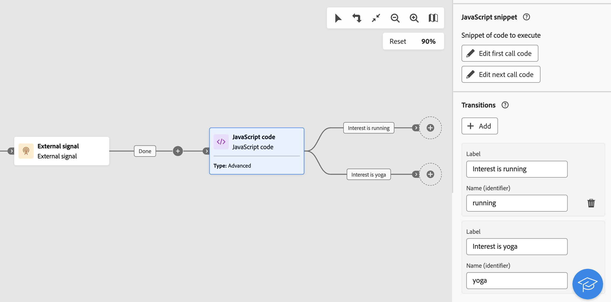

# JavaScript code {#javascript-code}

>[!CONTEXTUALHELP]
>id="acw_orchestration_javascript"
>title="JavaScript code"
>abstract="Med aktiviteten **JavaScript-kod** kan du köra ett JavaScript-skript i ett arbetsflödes kontext. På så sätt kan du utföra åtgärder eller samla in information från databasen. Använd **enkla** JavaScript-kodaktiviteter för att köra ett kodfragment under arbetsflödeskörning. **Avancerade** JavaScript-kodaktiviteter gör att du kan utföra mer komplexa åtgärder genom att köra två olika kodfragment sekventiellt. Första gången arbetsflödet startas körs det första anropet. Varje gång arbetsflödet körs igen körs koden som definierats i det andra anropet."

>[!CONTEXTUALHELP]
>id="acw_orchestration_javascript_snippet"
>title="JavaScript-kodfragment"
>abstract="Definiera skriptet som ska köras när aktiviteten körs. Om du konfigurerar en **Avancerad** JavaScript-aktivitet redigerar du två kodfragment: den första anropskoden som ska köras under den första arbetsflödeskörningen och nästa anropskod som ska köras under efterföljande arbetsflödeskörningar."

>[!CONTEXTUALHELP]
>id="acw_orchestration_javascript_execution"
>title="Körning av JavaScript"
>abstract="Konfigurera körningsfördröjningen för att stoppa aktiviteten efter en körningsperiod. Som standard får körningsfasen inte överskrida 1 timme. Efter den här fördröjningen avbryts processen med ett felmeddelande och aktivitetskörningen misslyckas. Om du vill ignorera den här gränsen anger du värdet 0."

>[!CONTEXTUALHELP]
>id="acw_orchestration_javascript_transition"
>title="JavaScript Transition"
>abstract="Om du vill lägga till en eller flera utdataövergångar klickar du på knappen **[!UICONTROL Add transitions]** och anger en etikett och ett internt namn för varje övergång."

>[!CONTEXTUALHELP]
>id="acw_orchestration_javascript_processerrors"
>title="Processfel"
>abstract="Växla på alternativet **[!UICONTROL Process errors]** om du vill behålla fel som inträffar under skriptkörningen i en ytterligare utdataövergång."

Aktiviteten **JavaScript-kod** är en **datahanteringsaktivitet**. Använd den här aktiviteten för att köra ett JavaScript-skript i ett arbetsflödes sammanhang. På så sätt kan du samla in information från databasen eller utföra andra komplexa åtgärder.

## Konfigurera JavaScript-kodaktiviteten {#javascript-code-configuration}

Följ de här stegen för att konfigurera aktiviteten **JavaScript-kod**:

1. Lägg till en **JavaScript-kodsaktivitet** i arbetsflödet.

1. Välj vilken typ av aktivitet som ska skapas:

   * **Enkel**: Kör ett kodfragment.
   * **Avancerat**: Utför mer avancerade åtgärder genom att köra två olika kodfragment. [Lär dig konfigurera en avancerad JavaScript-aktivitet](#advanced)

   >[!NOTE]
   >
   >Med Campaigns webbanvändargränssnitt har två aktiviteter konsoliderats till en genom att sammanfoga både **enkla**- och **avancerade** JavaScript-kodfunktioner. Den här konsolideringen påverkar inte aktivitetens funktion.

1. Bekräfta och klicka sedan på knappen **[!UICONTROL Edit code]** för att öppna uttrycksredigeraren. I den vänstra rutan finns fördefinierade syntaxer som du kan använda för att skapa koden, inklusive händelsevariabler. [Lär dig hur du arbetar med händelsevariabler och uttrycksredigeraren](../event-variables.md).

   

1. Konfigurera fördröjningen i avsnittet **[!UICONTROL Execution]** för att stoppa aktiviteten efter en körningsperiod. Som standard får körningsfasen inte överskrida 1 timme. Efter den här fördröjningen avbryts processen med ett felmeddelande och aktivitetskörningen misslyckas. Om du vill ignorera den här gränsen anger du värdet 0.

   

1. Växla på alternativet **[!UICONTROL Process errors]** om du vill behålla fel som inträffar under skriptkörningen i en ytterligare utdataövergång.

## Avancerade JavaScript-kodaktiviteter {#advanced}

Med avancerade JavaScript-aktiviteter kan du utföra komplexa åtgärder. Med dessa aktiviteter kan du:

* Kör två olika kodfragment. Det första kodfragmentet körs första gången arbetsflödet startas. Varje gång arbetsflödet körs igen körs det kodfragment som definierats i det andra anropet.
* Lägg till flera utdataövergångar som du kan interagera dynamiskt med med ett skript.

Så här konfigurerar du en avancerad JavaScript-kodaktivitet:

1. Välj typen **Avancerat** och konfigurera sedan kodfragmenten så att de körs:

   * Klicka på **[!UICONTROL Edit first call code]** för att definiera skriptet som ska köras under det första anropet.
   * Klicka på **[!UICONTROL Edit next call code]** för att definiera skriptet som ska köras under efterföljande anrop av arbetsflödet. (valfritt)

1. Om du vill lägga till en eller flera utdataövergångar klickar du på knappen **[!UICONTROL Add transitions]** och anger en etikett och ett internt namn för varje övergång.

   I det här exemplet konfigureras och aktiveras två övergångar av skriptet i kodfragmentet baserat på specifika villkor.

   

1. Slutför aktivitetskonfigurationen och starta arbetsflödet.

## Exempel {#javascript-code-example}

### Initiera variabler baserat på inkommande population {#example1}

I det här exemplet visas hur du initierar en variabel baserat på antalet profiler som ett arbetsflöde har som mål.


I det här exemplet används VIP-profiler från databasen. En variabel med namnet&quot;channel&quot; skapas med ett värde som är beroende av antalet profiler som målgruppsaktiviteten Build har:

* Om fler än 1 000 profiler används som mål initierar du variabeln med värdet &quot;email&quot;.
* Annars initierar du den med värdet &quot;sms&quot;.

Följ de här stegen för att uppnå detta:

1. Lägg till en **JavaScript-kodsaktivitet** med typen **Enkel** efter **Skapa målgruppsaktivitet**.

1. Klicka på **Redigera kod** och konfigurera kodfragmentet så som visas nedan:

   ```
   if (vars.recCount > 1000)
       vars.channel = "email";
   else
       vars.channel = "sms";
   ```

1. Starta arbetsflödet. Variabeln &quot;channel&quot; skapas med värdet &quot;email&quot; eller &quot;sms&quot;, beroende på antalet profiler som är riktade till aktiviteten **Bygg målgrupp**.

### Utlösa övergångar baserat på en variabels värde {#example2}

I det här exemplet visas hur du utlöser en övergång baserat på värdet för en variabel.



I det här exemplet börjar arbetsflödet med en **extern signal**-aktivitet som en variabel (`interest`) skickas från ett annat arbetsflöde. Variabelvärdet är antingen&quot;running&quot; eller&quot;yoga&quot;, beroende på vilka filtreringsåtgärder som har utförts i det inledande arbetsflödet.

Olika övergångar i arbetsflödet aktiveras baserat på variabelns värde.

Följ de här stegen för att uppnå detta:

1. Lägg till en **JavaScript-kodsaktivitet** efter den externa signalaktiviteten med typen **Avancerat**.

1. Lägg till två övergångar: en för varje möjligt variabelvärde (&quot;running&quot;, &quot;yoga&quot;).

1. Klicka på **Redigera den första anropskoden** och konfigurera kodfragmentet enligt nedan:

   ```
   if (vars.interest == "running")
       task.postEvent(task.transitionByName("running"));
   else
       task.postEvent(task.transitionByName("yoga"));
   ```

1. Slutför konfigurationen av varje övergång efter dina behov och starta sedan arbetsflödet. En av de två utdataövergångarna aktiveras baserat på värdet för variabeln `interest` som skickas via aktiviteten **Extern signal**.