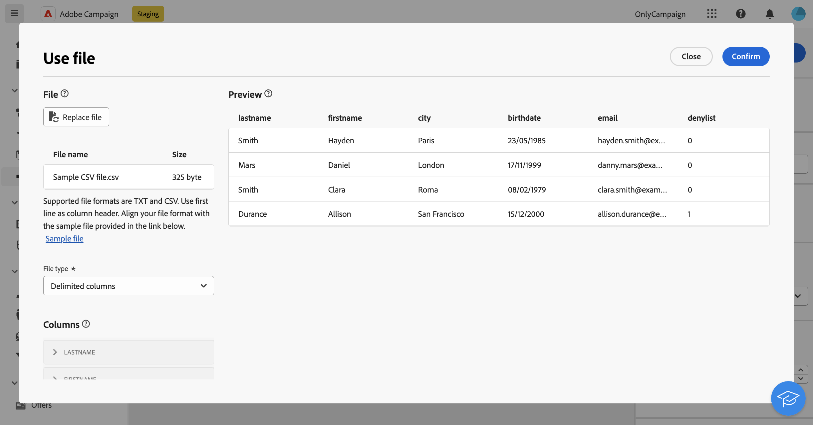

# Ladda fil {#load-file}

>[!CONTEXTUALHELP]
>id="acw_orchestration_loadfile"
>title="Läs in filaktivitet"
>abstract="The **Läs in fil** aktiviteten är en **Datahantering** aktivitet. Använd den här aktiviteten när du vill arbeta med data som lagras i en extern fil. Profiler och data läggs inte till i databasen, men alla fält i indatafilen är tillgängliga för anpassning, för att uppdatera profiler eller andra tabeller. "

>[!CONTEXTUALHELP]
>id="acw_orchestration_loadfile_outboundtransition"
>title="Avvisa utgående övergång för hantering"
>abstract="Avvisa utgående övergång för hantering"

>[!CONTEXTUALHELP]
>id="acw_orchestration_loadfile_outboundtransition_reject"
>title="Avvisa utgående övergång för hantering av avslag"
>abstract="Avvisa utgående övergång för hantering av avslag"

The **Läs in fil** aktiviteten är en **Datahantering** aktivitet. Använd den här aktiviteten när du vill arbeta med profiler och data som lagras i en extern fil. Profiler och data läggs inte till i databasen, men alla fält i indatafilen är tillgängliga för [personalisering](../../personalization/gs-personalization.md)eller för att uppdatera profiler eller andra tabeller.

>[!NOTE]
>Filformat som stöds är: text (TXT) och kommaavgränsade värden (CSV). Du kan läsa in filer som är högst 50 MB stora.

Den här aktiviteten kan användas med en [Avstämning](reconciliation.md) aktivitet för att länka oidentifierade data till befintliga resurser. Till exempel **Läs in fil** kan placeras före en **Avstämning** om du importerar data som inte är standard till databasen.

## Konfigurera aktiviteten Läs in fil {#load-configuration}

The **Läs in fil** aktivitetskonfigurationen omfattar två steg. Först måste du definiera den förväntade filstrukturen genom att överföra en exempelfil.  När du är klar kan du ange ursprunget för filen vars data ska importeras. Konfigurera aktiviteten genom att följa stegen nedan.

### Konfigurera exempelfilen {#sample}

>[!AVAILABILITY]
>
>Den här funktionen är begränsad tillgänglighet (LA). Den är begränsad till kunder som kör på en Campaign-server v8.7 och kan inte distribueras i någon annan miljö.

>[!CONTEXTUALHELP]
>id="acw_orchestration_loadfile_samplefile"
>title="Exempelfil"
>abstract="Välj den förväntade filstrukturen genom att överföra en exempelfil."

>[!CONTEXTUALHELP]
>id="acw_orchestration_loadfile_formatting"
>title="Formatering för aktiviteten Läs in fil"
>abstract="I **Formatering** anger du hur filen ska formateras för att säkerställa att data importeras på rätt sätt."

>[!CONTEXTUALHELP]
>id="acw_orchestration_loadfile_valueremapping"
>title="Värdeommappning för aktiviteten Läs in fil"
>abstract="Använd det här alternativet om du vill mappa specifika värden från de inlästa filerna med nya värden. Om kolumnen till exempel innehåller värdena &quot;Sant&quot;/&quot;Falskt&quot; kan du lägga till en mappning som automatiskt ersätter dessa värden med tecknen &quot;0&quot;/&quot;1&quot;."

Följ de här stegen för att konfigurera exempelfilen som används för att definiera den förväntade filstrukturen:

1. Lägg till en **Läs in fil** i arbetsflödet.

1. Välj den exempelfil som ska användas för att definiera den förväntade filstrukturen. Klicka på **Välj fil** knappen i **[!UICONTROL Sample file]** och välj den lokala fil som ska användas.

   >[!NOTE]
   >
   >Data i exempelfilen används för att konfigurera aktiviteten men importeras inte.  Vi rekommenderar att du använder en exempelfil som innehåller lite data. Filformatet måste vara justerat mot detta [exempelfil](../../audience/file-audience.md#sample-file).

1. En förhandsgranskning av exempelfilen visas med högst 30 rader.

1. I **[!UICONTROL File type]** Ange om filen använder avgränsade kolumner eller kolumner med fast bredd.

   

1. För avgränsade kolumnfiltyper använder du **Kolumner** för att konfigurera egenskaperna för varje kolumn.

   +++Tillgängliga alternativ för filkolumner

   * **[!UICONTROL Label]**: Etikett som ska visas för kolumnen.
   * **[!UICONTROL Data type]**: Typ av data i kolumnen.
   * **[!UICONTROL Width]** (strängdatatyp): Maximalt antal tecken som ska visas i kolumnen.
   * **[!UICONTROL Data Transformation]** (strängdatatyp): Använd omformning på värdena i kolumnen.
   * **[!UICONTROL White space management]** (strängdatatyp): Ange hur blanksteg i kolumnen ska hanteras.
   * **[!UICONTROL Separators]** (datatyperna date, time, integer och number)*: Ange de tecken som ska användas som avgränsare.
   * **[!UICONTROL Allow NULLs]**: Ange hur tomma värden ska hanteras i kolumnen. Alternativet&quot;Adobe Campaign-standard&quot; genererar ett fel om det finns ett tomt värde.
   * **[!UICONTROL Error processing]** (strängdatatyp): Ange beteendet vid fel på en av raderna.
   * **[!UICONTROL Value remapping]**: Med det här alternativet kan du mappa specifika värden till nya. Om kolumnen till exempel innehåller värdena &quot;Sant&quot;/&quot;Falskt&quot; kan du lägga till en mappning som automatiskt ersätter dessa värden med tecknen &quot;0&quot;/&quot;1&quot;.

+++

1. I **Formatering** anger du hur filen ska formateras för att säkerställa att data importeras på rätt sätt.

### Definiera målfilen som ska överföras {#target}

>[!CONTEXTUALHELP]
>id="acw_orchestration_loadfile_targetfile"
>title="Målfil för aktiviteten Läs in fil"
>abstract="I **[!UICONTROL Target file]** anger du hur filen ska hämtas till servern."

>[!CONTEXTUALHELP]
>id="acw_orchestration_loadfile_nameofthefile"
>title="Filens namn"
>abstract="Ange namnet på fältet som ska överföras till servern. Klicka på **[!UICONTROL Open personalization dialog]** om du vill använda uttrycksredigeraren, inklusive händelsevariabler, för att beräkna filnamnet."

>[!CONTEXTUALHELP]
>id="acw_orchestration_loadfile_targetdb"
>title="Måldatabas"
>abstract="Om du använder en **[!UICONTROL Load file]** aktivitet som redan har konfigurerats i klientkonsolen, ytterligare **[!UICONTROL Target database]** -avsnittet är tillgängligt om du har konfigurerat aktiviteten att överföra filen till en extern databas."

>[!CONTEXTUALHELP]
>id="acw_orchestration_loadfile_command"
>title="Kommandot Läs in fil"
>abstract="Att tillåta godtyckligt kommando för förbehandling är ett säkerhetsproblem, inaktivera säkerhetsalternativet XtkSecurity_Disable_Preproc för att tvinga fram användning av en fördefinierad lista med kommandon."

>[!CAUTION]
>
>Innan du läser in målfilen kontrollerar du att den följer exempelfilens formatering. Eventuella avvikelser i filformat, kolumnstruktur eller antal kolumner kan leda till fel under körningen av arbetsflödet.

1. I **[!UICONTROL Target file]** anger du vilken åtgärd som ska utföras när filen som ska överföras till servern hämtas.

   * **[!UICONTROL Upload file from local machine]**: Välj den fil som ska överföras från datorn.

   * **[!UICONTROL Specified in the transition]**: Överför filen som anges i den inkommande övergången som kommer från en tidigare aktivitet, till exempel **[!UICONTROL Transfer file]**.

   * **[!UICONTROL Pre-process the file]**: Överför filen som angavs i föregående övergång och använd ett förbehandlingskommando för den, till exempel **[!UICONTROL Decompression]** eller **[!UICONTROL Decrypt]**.

   * **[!UICONTROL Calculated]**: Överför filen vars namn anges i **[!UICONTROL File name]** fält. Klicka på **[!UICONTROL Open personalization dialog]** om du vill använda uttrycksredigeraren, inklusive händelsevariabler, för att beräkna filnamnet.

   

   >[!NOTE]
   >
   >Om du använder en **[!UICONTROL Load file]** aktivitet som redan har konfigurerats i klientkonsolen, ytterligare **[!UICONTROL Target database]** visas om du har konfigurerat aktiviteten att överföra filen till en extern databas. Du kan ange om du vill överföra filen på Campaign-servern eller i den externa databasen.

### Ytterligare alternativ {#options}

>[!CONTEXTUALHELP]
>id="acw_orchestration_loadfile_rejectmgt"
>title="Avvisa hantering för Läs in filaktivitet"
>abstract="I **Avvisningshantering** anger du hur aktiviteten ska fungera om fel uppstår. Du kan definiera maximalt antal fel som ska tillåtas och växla **[!UICONTROL Keep rejects in a file]** om du vill hämta en fil som innehåller de fel som inträffade under importen till servern."

>[!CONTEXTUALHELP]
>id="acw_orchestration_loadfile_delete"
>title="Ta bort fil efter import"
>abstract="Växla **Ta bort fil efter import** om du vill ta bort originalfilen från servern när filen har importerats."

>[!AVAILABILITY]
>
>De här alternativen är i Begränsad tillgänglighet (LA). De är begränsade till kunder som kör på en Campaign-server v8.7 och kan inte distribueras i någon annan miljö.

1. I **Avvisningshantering** anger du hur aktiviteten ska fungera vid fel:

   * I **[!UICONTROL Dele]** -fält, ange det maximala antalet fel som tillåts när filen som ska läsas in bearbetas. Om värdet till exempel är 20 misslyckas arbetsflödeskörningen om det finns mer än 20 fel när filen läses in.

   * Om du vill behålla felen som uppstod när filen lästes in, växlar du **[!UICONTROL Keep rejects in a file]** på och ange önskat namn för filen i **[!UICONTROL Rejection File]** fält.

     När du har aktiverat det här alternativet läggs ytterligare en utdataövergång till som heter &quot;Komplettera&quot; efter aktiviteten. Alla fel som inträffar under importen lagras i den angivna filen på servern.

1. Om du vill ta bort den överförda filen från servern efter att arbetsflödet har körts växlar du **[!UICONTROL Delete file after import]** alternativ.

   

1. Klicka **Bekräfta** när inställningarna är korrekta.

## Exempel {#load-example}

Ett exempel på en extern inläsning av filer som används med **Avstämning** aktivitet är tillgänglig i [det här avsnittet](reconciliation.md#reconciliation-example).
