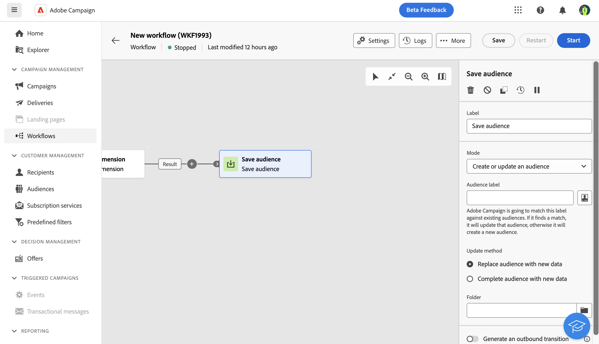

# Spara målgrupp {#save-audience}

>[!CONTEXTUALHELP]
>id="acw_orchestration_save_audience"
>title="Spara en publik"
>abstract="Använd den här aktiviteten för att uppdatera en befintlig målgrupp eller skapa en ny målgrupp från den population som beräknas uppströms i arbetsflödet. De målgrupper som skapas läggs till i listan över målgrupper och är tillgängliga via menyn **Publiker** ."

>[!CONTEXTUALHELP]
>id="acw_orchestration_saveaudience_outbound"
>title="Generera utgående övergång"
>abstract="Använd det här alternativet om du vill lägga till en övergång efter aktiviteten **Spara målgrupp**."

Aktiviteten **Spara målgrupp** är en **målaktivitet**. Med den här aktiviteten kan du uppdatera en befintlig målgrupp eller skapa en ny målgrupp utifrån den population som beräknas uppströms i ett arbetsflöde. De målgrupper som skapas läggs till i listan över programmålgrupper och blir tillgängliga via menyn **Publiker** .

Den här aktiviteten används främst för att behålla populationsgrupper som beräknas i samma arbetsflöde genom att konvertera dem till återanvändbara målgrupper. Koppla det till andra målinriktningsaktiviteter som **Skapa målgrupp** eller en **Kombinera**-aktivitet.

## Konfigurera aktiviteten Spara målgrupp {#save-audience-configuration}

Så här konfigurerar du aktiviteten **Spara målgrupp**:

1. Lägg till en **Spara målgruppsaktivitet** i arbetsflödet.

1. I listrutan **Läge** väljer du den åtgärd som du vill utföra:

   * **Skapa eller uppdatera en befintlig målgrupp**: Definiera en **publiketikett**. Om målgruppen redan finns uppdateras den, annars skapas en ny målgrupp.

   * **Uppdatera en befintlig målgrupp**: Välj den **målgrupp** som du vill uppdatera i listan över befintliga målgrupper.

1. Välj det **uppdateringsläge** som gäller för befintliga målgrupper:

   * **Ersätt målgruppsinnehåll med nya data**: Allt målgruppsinnehåll ersätts och gamla data går förlorade. Endast data från den inkommande övergången för aktiviteten **Spara målgrupp** behålls. Med det här alternativet raderas målgruppstypen och målgruppsdimensionen för den uppdaterade målgruppen.

   * **Fullständig målgrupp med nya data**: Det gamla målgruppsinnehållet behålls och data från den inkommande övergången för aktiviteten **Spara målgrupp** läggs till i den.

1. Markera alternativet **Generera en utgående övergång** om du vill lägga till en övergång efter aktiviteten **Spara målgrupp**.

Innehållet i den sparade målgruppen är sedan tillgängligt i detaljvyn för målgruppen, som du kommer åt på menyn **Publiker** . Kolumnerna som är tillgängliga i den här vyn motsvarar kolumnerna för den inkommande övergången i arbetsflödets **Spara målgruppsaktivitet**.

## Exempel {#save-audience-example}

I följande exempel visas en enkel målgruppsuppdatering från målinriktning. En schemaläggare kör arbetsflödet en gång i månaden. En fråga hämtar alla profiler som prenumererar på de olika tillgängliga programmen. Aktiviteten **Spara målgrupp** uppdaterar målgruppen genom att ta bort profiler som har avbrutit prenumerationen från tjänsten sedan den senaste arbetsflödeskörningen och lagt till nya prenumerationsprofiler.