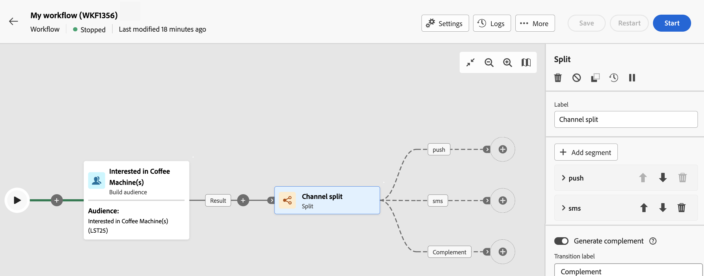

# Dela {#split}

>[!CONTEXTUALHELP]
>id="acw_orchestration_split"
>title="Delad aktivitet"
>abstract="The **Dela** Med -aktivitet kan du segmentera inkommande populationer i flera deluppsättningar baserat på olika urvalskriterier, t.ex. filtreringsregler eller populationsstorlek."

The **Dela** aktiviteten är en **Målinriktning** aktivitet som gör att du kan segmentera inkommande populationer i flera deluppsättningar baserat på olika urvalskriterier, t.ex. filtreringsregler eller populationsstorlek.

## Konfiguration {#general}

>[!CONTEXTUALHELP]
>id="acw_orchestration_split_filter"
>title="Dela aktivitetsfilter"
>abstract="Om du vill använda ett filtervillkor på delmängden klickar du på **[!UICONTROL Create filter]** och konfigurera önskad filtreringsregel. Ta till exempel med profiler från den inkommande populationen vars e-postadress finns i databasen."

>[!CONTEXTUALHELP]
>id="acw_orchestration_split_limit"
>title="Gräns för delad aktivitet"
>abstract="Om du vill begränsa antalet profiler som markeras av delmängden aktiverar du **[!UICONTROL Enable limit]** och ange antal eller procentandelar av populationen som ska inkluderas."

>[!CONTEXTUALHELP]
>id="acw_orchestration_split_sorting"
>title="Sortering av delad aktivitet"
>abstract="När du anger en populationsgräns för en delmängd kan du rangordna de valda profilerna baserat på ett visst profilattribut i stigande eller fallande ordning. Aktivera **Aktivera sortering** alternativ. Du kan till exempel begränsa en delmängd så att den endast innehåller de 50 översta profilerna med det högsta inköpspriset."

Följ de här stegen för att konfigurera **Dela** aktivitet:

1. Lägg till en **Dela** till ditt arbetsflöde.

1. Aktivitetskonfigurationsrutan öppnas med en standarddelmängd. Klicka på **Lägg till segment** om du vill lägga till så många delmängder som behövs för att segmentera den inkommande populationen.

   

   >[!IMPORTANT]
   >
   >När den delade aktiviteten utförs segmenteras populationen över de olika delmängderna i den ordning som de läggs till i aktiviteten. Om till exempel den första delmängden återställer 70 % av den ursprungliga populationen, kommer nästa tillagda delmängd endast att tillämpa sina urvalskriterier på de återstående 30 %, och så vidare.
   >
   > Innan du konfigurerar dina delmängder måste du se till att du har lagt till dem i rätt ordning eftersom deras position inte kan ändras.

1. När deluppsättningar har lagts till visar aktiviteten så många utdataövergångar som det finns deluppsättningar. Vi rekommenderar starkt att du ändrar etiketten för varje delmängd så att du enkelt kan identifiera dem på arbetsytan.

1. Konfigurera hur varje delmängd ska filtrera den inkommande populationen. Följ dessa steg för att göra detta:

   1. Öppna delmängden för att visa dess egenskaper.

   1. Om du vill använda ett filtervillkor på delmängden klickar du på **[!UICONTROL Create filter]** och konfigurera önskad filtreringsregel. Ta till exempel med profiler från den inkommande populationen vars e-postadress finns i databasen.

   1. Om du vill begränsa antalet profiler som markeras av delmängden aktiverar du **[!UICONTROL Enable limit]** och ange antal eller procentandelar av populationen som ska inkluderas.

      

      >[!NOTE]
      >
      >När du anger en populationsgräns för en delmängd kan du rangordna de valda profilerna baserat på ett visst profilattribut i stigande eller fallande ordning. Aktivera **[!UICONTROL Enable sorting]** alternativ. Du kan till exempel begränsa en delmängd så att den endast innehåller de 50 översta profilerna med det högsta inköpspriset.

1. När du har konfigurerat alla deluppsättningar kan du välja den återstående populationen som inte matchade någon av deluppsättningarna och inkludera dem i en ytterligare utgående övergång. Aktivera **[!UICONTROL Generate complement]** alternativ.

   

Aktiviteten är nu konfigurerad. När arbetsflödet körs segmenteras populationen i de olika deluppsättningarna, i den ordning som de har lagts till i aktiviteten.

## Exempel

I följande exempel **[!UICONTROL Split]** -aktiviteten används för att segmentera en målgrupp i olika delmängder baserat på den kommunikationskanal som vi vill använda:

* **Delmängd 1 &quot;push&quot;**: Den här deluppsättningen omfattar alla profiler som har installerat vårt mobilprogram.
* **Delmängd 2 &quot;sms&quot;**: Användare av mobiltelefoner: För den återstående populationen som inte ingick i delmängd 1 tillämpar delmängd 2 en filtreringsregel för att välja profiler med mobiltelefoner i databasen.
* **Kompletteringsövergång**: Den här övergången fångar alla återstående profiler som inte matchade delmängd 1 eller delmängd 2. Det omfattar profiler som varken har installerat mobilappen eller en mobiltelefon, till exempel användare som inte har installerat mobilappen eller saknar ett registrerat mobilnummer.

