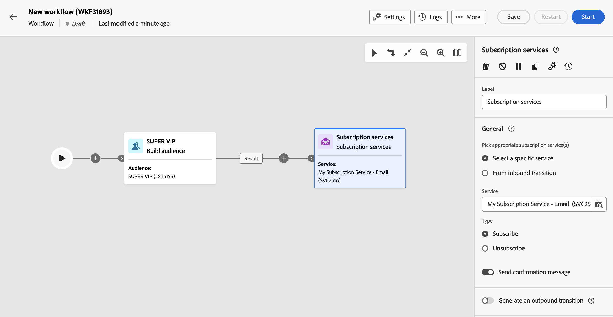
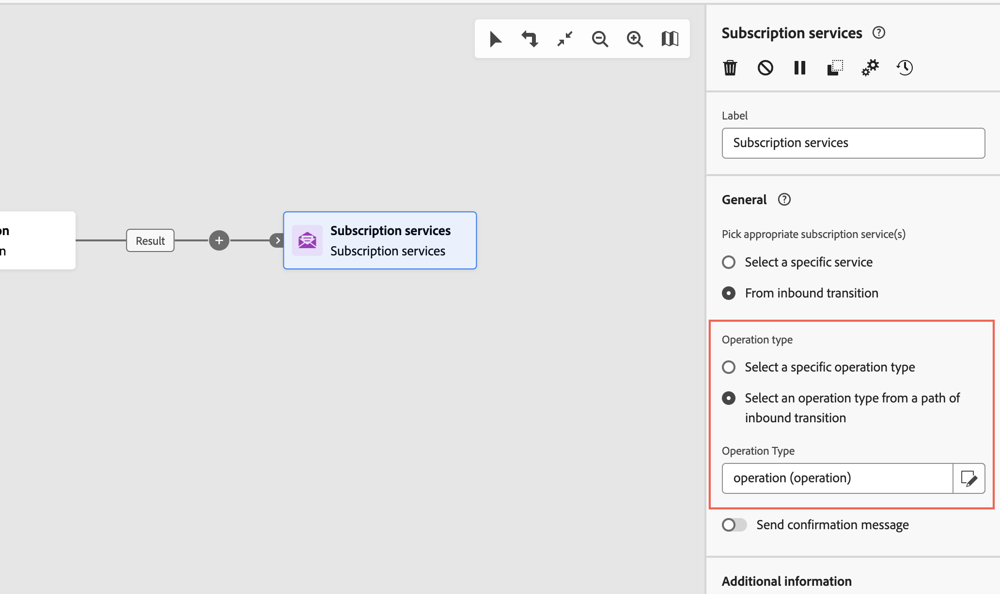

# Prenumerationstjänster {#subscriptipon-services}

>[!CONTEXTUALHELP]
>id="acw_orchestration_subscription"
>title="Prenumerationstjänster"
>abstract="Med aktiviteten Prenumerationstjänster kan flera profiler prenumereras på eller avbeställas från en tjänst i en enda åtgärd."

>[!CONTEXTUALHELP]
>id="acw_orchestration_subscription_general"
>title="Allmänna parametrar för prenumerationstjänsten"
>abstract="Välj önskad tjänst och välj den åtgärd som ska utföras (prenumeration eller prenumeration). Växla på **Skicka bekräftelsemeddelande** för att meddela populationen att de prenumererar eller avbeställer den valda tjänsten."

>[!CONTEXTUALHELP]
>id="acw_orchestration_subscription_outboundtransition"
>title="Generera en utgående övergång"
>abstract="Växla **Generera en utgående övergång** alternativ för att lägga till en övergång efter aktiviteten."

The **Prenumerationstjänster** aktiviteten är en **Datahantering** aktivitet. Du kan skapa eller ta bort en prenumeration på en informationstjänst för den population som anges i övergången.

## Konfigurera aktiviteten för prenumerationstjänster {#subscription-services-configuration}

Följ de här stegen för att konfigurera **Prenumerationstjänster** aktivitet:

1. Lägg till en **Prenumerationstjänster** i arbetsflödet. Du kan använda den här aktiviteten efter att du har angett profiler som mål eller importerat en fil med identifierade data.

1. Välj den tjänst som du vill hantera prenumerationerna för med något av följande alternativ:

   * **[!UICONTROL Select a specific service]**: Välj en tjänst manuellt med **[!UICONTROL Service]** fält.

   * **[!UICONTROL From inbound transition]**: Använd den tjänst som anges i övergången för inkommande trafik. Du kan till exempel importera en fil som anger vilken tjänst som ska hanteras för varje rad. Tjänsten som åtgärden ska utföras på väljs sedan dynamiskt för varje profil.

   

1. Välj den åtgärd som ska utföras: **Prenumerera** eller **Avbeställ**.

   Om tjänsten definieras i övergången kan du välja hur du vill hämta den här åtgärden:

   * **Välj en viss åtgärdstyp**: Markera åtgärden som ska utföras manuellt (**Prenumerera** eller **Avbeställ**)

   * **Välj en åtgärdstyp från en bana för inkommande övergång**: Välj den kolumn med inkommande data som anger vilken åtgärd som ska utföras för varje post. Du kan till exempel importera en fil som anger vilken åtgärd som ska utföras för varje rad i en åtgärdskolumn.

     >[!NOTE]
     >
     >Endast booleska fält eller heltalsfält kan markeras här. Kontrollera att data som innehåller åtgärden som ska utföras matchar det här formatet. Om du till exempel läser in data från en Läs in fil-aktivitet, kontrollerar du att du har angett formatet på kolumnen som innehåller åtgärden i **[!UICONTROL Load file]** aktivitet. Ett exempel presenteras i [det här avsnittet](#uc2).

   

1. Om du vill meddela mottagarna att de prenumererar på eller avbeställer den valda tjänsten, växlar du **[!UICONTROL Send a confirmation message]** på. Innehållet i det här meddelandet definieras i en leveransmall som är kopplad till informationstjänsten.

1. Om du använder data från en inkommande övergång kan du **[!UICONTROL Additional information]** visas så att du kan ange prenumerationens data och ursprung för varje post. Du kan lämna det här avsnittet tomt. I så fall kommer inget datum eller ursprung att anges när arbetsflödet körs.

   * Om inkommande data innehåller en kolumn som anger prenumerationsdatumet för profilen för tjänsten kan du välja den i **[!UICONTROL Date]** fält.

   * I **[!UICONTROL Origin path]** anger du prenumerationens ursprung. Du kan ställa in den på ett av fälten för inkommande data eller på ett valfritt konstant värde genom att kontrollera **[!UICONTROL Set a constant as origin]** alternativ.

   

1. Om du vill lägga till en utgående övergång efter aktiviteten växlar du **[!UICONTROL Generate an outbound transition]** på.

## Exempel {#example}

### Prenumerera på en viss tjänst {#uc1}

Det här arbetsflödet nedan visar hur du prenumererar på en befintlig tjänst.



* A **[!UICONTROL Build audience]** Verksamheten riktar sig till en befintlig målgrupp.

* A **[!UICONTROL Subscription Services]** Med -aktivitet kan du välja den tjänst som profilerna ska prenumereras på.

<!--
### Updating multiple subscription statuses from a file {#uc2}

The workflow below shows how to import a file containing profiles and update their subscription to several services specified in the file.


* A **[!UICONTROL Load file]** activity loads a CSV file containing the data and defines the structure of the imported columns. The "service" and "operation" columns specify the service to update and the operation to perform (subscription or unsubscription).

  ```
  Lastname,firstname,city,birthdate,email,service,operation
  Smith,Hayden,Paris,23/05/1985,hayden.smith@example.com,yoga,sub
  Mars,Daniel,London,17/11/1999,danny.mars@example.com,running,sub
  Smith,Clara,Roma,08/02/1979,clara.smith@example.com,running,unsub
  Durance,Allison,San Francisco,15/12/2000,allison.durance@example.com,yoga,sub
  Durance,Alison,San Francisco,15/12/2000,allison.durance@example.com,running,unsub
  ```

  As you may have noticed, the operation is specified in the file as "sub" or "unsub". The system expects a **Boolean** or **Integer** value to recognize the operation to perform: "0" to unsubscribe and "1" to subscribe. To match this requirement, a remapping of values must be performed in the detail of the "operation" column in the sample file configuration screen.

  

  If your file already uses "0" and "1" to identify the operation, you don't need to remap those values. Only make sure that the column is processed as a **Boolean** or **Integer** in the sample file columns.

* A **[!UICONTROL Reconciliation]** activity identifies the data from the file as belonging to the profile dimension of the Adobe Campaign database. The **email** field of the file is matched to the **email** field of the profile resource.

  

* An **[!UICONTROL Enrichment]** activity creates a link to the "Services (nms)" table and creates a simple join between the "service" column of the uploaded file, and the services "internal name" field in the database.

    

* A **[!UICONTROL Deduplication]** based on the **email** field identifies duplicates. It is important to eliminate duplicates since the subscription to a service will fail for all data in case of duplicates.

  
  
* A **[!UICONTROL Subscription Services]** identifies the services to update as coming from the transition, through the link created in the **[!UICONTROL Reconciliation]** activity.

  The **[!UICONTROL Operation type]** is identified as coming from the **operation** field of the file. Only Boolean or Integer fields can be selected here. If the column of your file that contains the operation to perform does not appear in the list, make sure that you have correctly set your column format in the **[!UICONTROL Load file]** activity, as explained earlier in this example.

  -->
