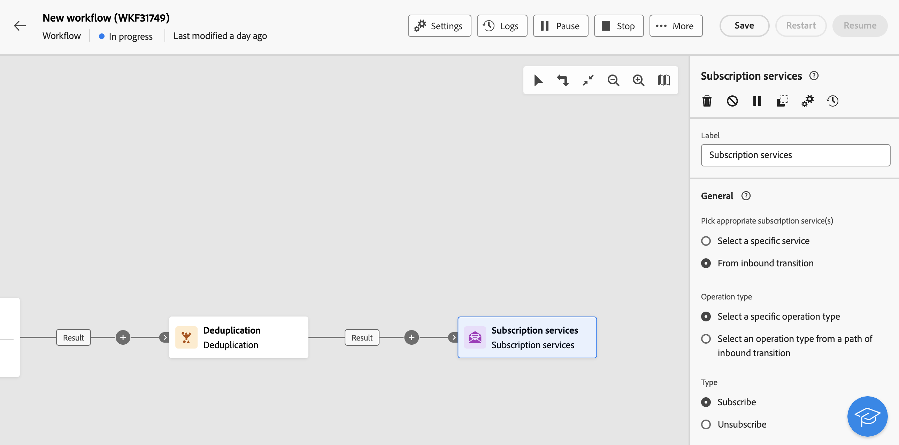
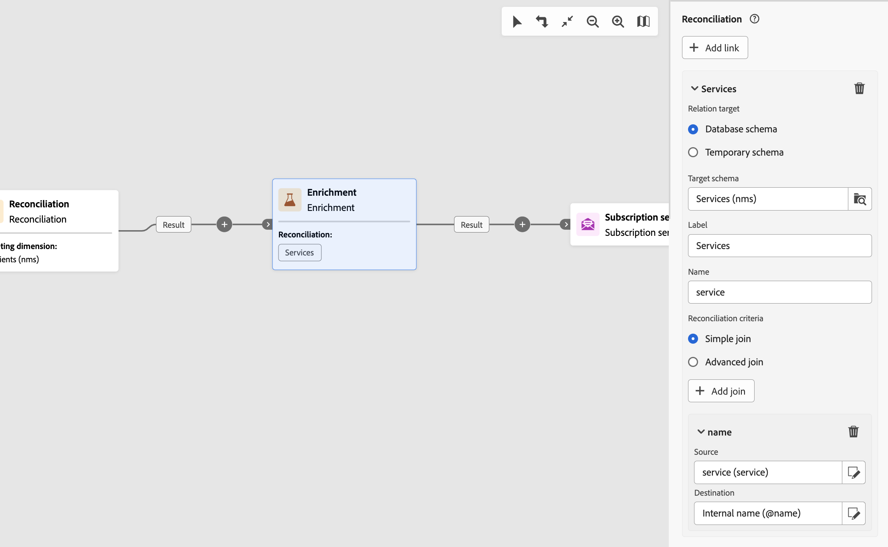
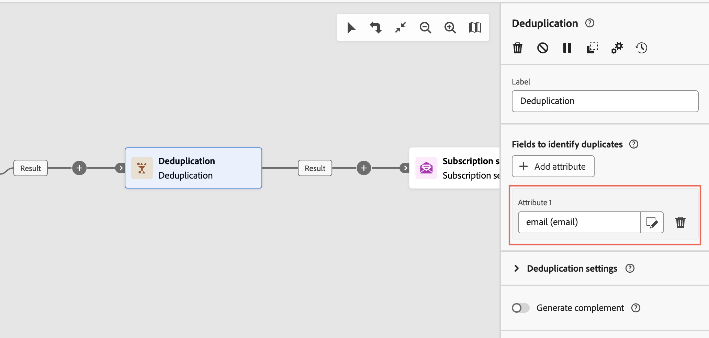

# Prenumerationstjänster {#subscriptipon-services}


>[!CONTEXTUALHELP]
>id="acw_orchestration_subscription"
>title="Prenumerationstjänster"
>abstract="Med aktiviteten Prenumerationstjänster kan flera profiler prenumereras på eller avbeställas från en tjänst i en enda åtgärd."

>[!CONTEXTUALHELP]
>id="acw_orchestration_subscription_general"
>title="Allmänna parametrar för prenumerationstjänsten"
>abstract="Välj önskad tjänst och välj den åtgärd som ska utföras (prenumeration eller prenumeration). Växla på **Skicka bekräftelsemeddelande** för att meddela populationen att de prenumererar eller avbeställer den valda tjänsten."

>[!CONTEXTUALHELP]
>id="acw_orchestration_subscription_outboundtransition"
>title="Generera en utgående övergång"
>abstract="Växla **Generera en utgående övergång** alternativ för att lägga till en övergång efter aktiviteten."

The **Prenumerationstjänster** aktiviteten är en **Datahantering** aktivitet. Du kan skapa eller ta bort en prenumeration på en informationstjänst för den population som anges i övergången.

## Konfigurera aktiviteten för prenumerationstjänster {#subscription-services-configuration}

Följ de här stegen för att konfigurera **Prenumerationstjänster** aktivitet:

1. Lägg till en **Prenumerationstjänster** i arbetsflödet. Du kan använda den här aktiviteten efter att du har angett profiler som mål eller importerat en fil med identifierade data.

1. Välj den tjänst som du vill hantera prenumerationerna för med något av följande alternativ:

   * **[!UICONTROL Select a specific service]**: Välj en tjänst manuellt med **[!UICONTROL Service]** fält.

   * **[!UICONTROL From inbound transition]**: Använd den tjänst som anges i övergången för inkommande trafik. Du kan till exempel importera en fil som anger vilken tjänst som ska hanteras för varje rad. Tjänsten som åtgärden ska utföras på väljs sedan dynamiskt för varje profil.

   

1. Välj den åtgärd som ska utföras: **Prenumerera** eller **Avbeställ**.

   Om tjänsten definieras i övergången kan du välja hur du vill hämta den här åtgärden:

   * **Välj en viss åtgärdstyp**: Markera åtgärden som ska utföras manuellt (**Prenumerera** eller **Avbeställ**)

   * **Välj en åtgärdstyp från en bana för inkommande övergång**: Välj den kolumn med inkommande data som anger vilken åtgärd som ska utföras för varje post. Du kan till exempel importera en fil som anger vilken åtgärd som ska utföras för varje rad i en åtgärdskolumn.

     >[!NOTE]
     >
     >Endast booleska fält eller heltalsfält kan markeras här. Kontrollera att data som innehåller åtgärden som ska utföras matchar det här formatet. Om du till exempel läser in data från en Läs in fil-aktivitet, kontrollerar du att du har angett formatet på kolumnen som innehåller åtgärden i **[!UICONTROL Load file]** aktivitet. Ett exempel presenteras i [det här avsnittet](#uc2).

   

1. Om du vill meddela mottagarna att de prenumererar på eller avbeställer den valda tjänsten, växlar du **[!UICONTROL Send a confirmation message]** på. Innehållet i det här meddelandet definieras i en leveransmall som är kopplad till informationstjänsten.

1. Om du använder data från en inkommande övergång kan du **[!UICONTROL Additional information]** visas så att du kan ange prenumerationens data och ursprung för varje post. Du kan lämna det här avsnittet tomt. I så fall kommer inget datum eller ursprung att anges när arbetsflödet körs.

   * Om inkommande data innehåller en kolumn som anger prenumerationsdatumet för profilen för tjänsten kan du välja den i **[!UICONTROL Date]** fält.

   * I **[!UICONTROL Origin path]** anger du prenumerationens ursprung. Du kan ställa in den på ett av fälten för inkommande data eller på ett valfritt konstant värde genom att kontrollera **[!UICONTROL Set a constant as origin]** alternativ.

   

1. Om du vill lägga till en utgående övergång efter aktiviteten växlar du **[!UICONTROL Generate an outbound transition]** på.

## Exempel {#example}

### Prenumerera på en viss tjänst {#uc1}

Det här arbetsflödet nedan visar hur du prenumererar på en befintlig tjänst.


* A **[!UICONTROL Build audience]** Verksamheten riktar sig till en befintlig målgrupp.

* A **[!UICONTROL Subscription Services]** Med -aktivitet kan du välja den tjänst som profilerna ska prenumereras på.

### Uppdatera flera prenumerationsstatusar från en fil {#uc2}

I arbetsflödet nedan visas hur du importerar en fil som innehåller profiler och uppdaterar deras prenumeration till flera tjänster som anges i filen.


* A **[!UICONTROL Load file]** aktiviteten läser in en CSV-fil som innehåller data och definierar strukturen för de importerade kolumnerna. Kolumnerna&quot;service&quot; och&quot;operation&quot; anger vilken tjänst som ska uppdateras och vilken åtgärd som ska utföras (prenumeration eller prenumeration).

  ```
  Lastname,firstname,city,birthdate,email,service,operation
  Smith,Hayden,Paris,23/05/1985,hayden.smith@example.com,yoga,sub
  Mars,Daniel,London,17/11/1999,danny.mars@example.com,running,sub
  Smith,Clara,Roma,08/02/1979,clara.smith@example.com,running,unsub
  Durance,Allison,San Francisco,15/12/2000,allison.durance@example.com,yoga,sub
  Durance,Alison,San Francisco,15/12/2000,allison.durance@example.com,running,unsub
  ```

  Som du kanske har märkt anges åtgärden i filen som &quot;sub&quot; eller &quot;unsub&quot;. Systemet förväntar sig ett **booleskt värde** eller **heltalsvärde** som identifierar åtgärden som ska utföras: &quot;0&quot; för att avprenumerera och &quot;1&quot; för att prenumerera. För att uppfylla detta krav måste en ommappning av värden utföras i detalj i åtgärdskolumnen på exempelfilkonfigurationsskärmen.

  

  Om filen redan använder &quot;0&quot; och &quot;1&quot; för att identifiera operationen behöver du inte mappa om dessa värden. Kontrollera bara att kolumnen bearbetas som en **Boolean** eller **Heltal** i exempelfilkolumnerna.

* En **[!UICONTROL Reconciliation]**-aktivitet identifierar att data från filen tillhör profildimensionen i Adobe Campaign-databasen. The **e-post** filens fält matchas mot **e-post** profilresursens fält.

  

* An **[!UICONTROL Enrichment]** skapar en länk till tabellen&quot;Tjänster (nms)&quot; och skapar en enkel koppling mellan kolumnen&quot;tjänst&quot; i den överförda filen och fältet&quot;internt namn&quot; i databasen.

  

* A **[!UICONTROL Deduplication]** baserat på **e-post** identifierar dubbletter. Det är viktigt att ta bort dubbletter eftersom prenumerationen på en tjänst misslyckas för alla data om dubbletter förekommer.

  

* En **[!UICONTROL Subscription Services]** identifierar de tjänster som ska uppdateras från övergången via länken som skapas i **[!UICONTROL Reconciliation]**-aktiviteten.

  **[!UICONTROL Operation type]** identifieras som att det kommer från fältet **operation** i filen. Endast fälten Booleskt värde eller Heltalsvärde kan markeras här. Om kolumnen i filen som innehåller åtgärden som ska utföras inte visas i listan, ska du kontrollera att du har angett kolumnformatet korrekt i **[!UICONTROL Load file]**-aktiviteten, vilket förklaras ovan i det här exemplet.

  
