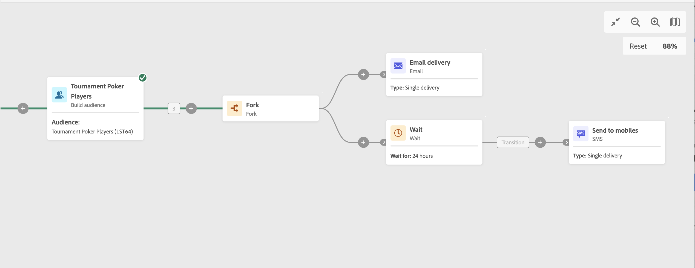

# Vänta {#wait}

>[!CONTEXTUALHELP]
>id="acw_orchestration_wait"
>title="Vänta på aktivitet"
>abstract="The **Vänta** används för att fördröja övergången från en aktivitet till en annan."

The **Vänta** aktiviteten är en **Flödeskontroll** aktivitet. Det används för att en viss tid ska kunna förflyta mellan två aktiviteter som utförs. Om du till exempel vill vänta flera dagar efter en aktivitet där e-post levererats så analyserar du de öppningar och klick som genereras under den här perioden innan du utför några uppföljningsåtgärder (påminnelser via e-post, målgruppsgenerering osv.).

## Konfiguration{#wait-configuration}

Följ de här stegen för att konfigurera **Vänta** aktivitet:

1. Lägg till en **Vänta** i arbetsflödet.

1. Ange **Varaktighet** av väntetiden mellan inkommande och utgående övergångar.

1. Välj tidsenhet i dialogrutan **Perioder** fält: sekunder, minuter, timmar, dagar.

## Exempel{#wait-example}

I följande exempel visas **Vänta** i vanliga fall. En e-postinbjudan till ett event skickas.  24 timmar efter att det skickats skickas ett SMS-meddelande till samma population.

