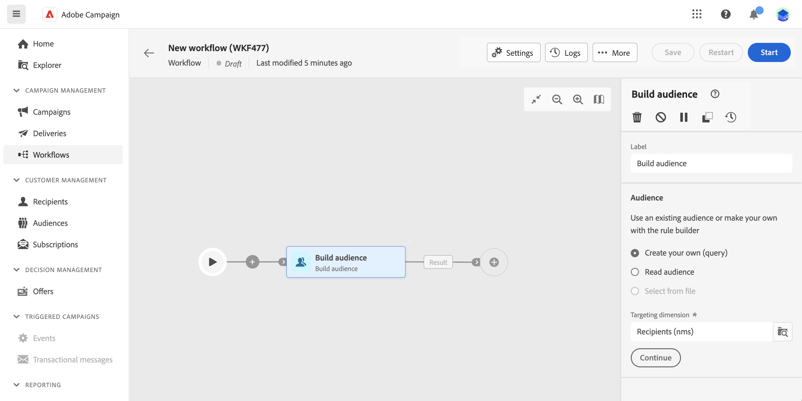

# Skapa ett arbetsflöde {#create}

>[!CONTEXTUALHELP]
>id="acw_workflow_creation_properties"
>title="Egenskaper för arbetsflöde"
>abstract="TBD"

## Skapa arbetsflödet {#create-workflow}

Det första steget för att skapa ett arbetsflöde i Campaign v8 Web är att skapa det antingen som ett fristående arbetsflöde eller direkt i en kampanj och definiera dess allmänna egenskaper. Gör så här:

1. Börja med att bestämma om du vill skapa ett fristående arbetsflöde eller integrera det direkt i en kampanj:

   * **Fristående arbetsflöde**: Navigera till menyn Arbetsflöde och klicka på knappen Skapa arbetsflöde i det övre högra hörnet.
   * **Kampanjarbetsflöde:** Navigera till Campaigns-menyn och öppna kampanjen där du vill skapa ett nytt arbetsflöde. Klicka på knappen Skapa arbetsflöde i det övre högra hörnet på fliken Arbetsflöden.

1. Dialogrutan Egenskaper för arbetsflöde visas. Välj den mall som ska användas för att skapa arbetsflödet och ange ett namn för det.

   Arbetsflödesmallar innehåller förkonfigurerade aktiviteter och övergripande egenskapskonfigurationer som kan återanvändas för att skapa nya arbetsflöden. De skapas från klientkonsolen. [Lär dig hur du arbetar med mallar](https://experienceleague.adobe.com/docs/campaign/automation/workflows/introduction/build-a-workflow.html#workflow-templates)

   

1. Konfigurera specifika inställningar för arbetsflödet, t.ex. lagringsmapp och tidszon, i avsnittet Ytterligare alternativ. [Lär dig hur du konfigurerar arbetsflödesegenskaper](workflow-settings.md)

1. Klicka på knappen Skapa arbetsflöde för att bekräfta att arbetsflödet har skapats.

När arbetsflödet har skapats kan du nu börja organisera de olika uppgifter som ska utföras med en dedikerad visuell arbetsyta. [Lär dig att samordna arbetsflödesaktiviteter](#build)

## Samordna arbetsflödesaktiviteter {#build}

En gång har du [skapade ett arbetsflöde](create-workflow.md), oavsett om det gäller arbetsflödesmenyn eller en kampanj, kan du börja organisera de olika uppgifter som ska utföras. För att göra detta finns en visuell arbetsyta som gör att du kan skapa ett arbetsflödesdiagram. I det här diagrammet kan du lägga till olika aktiviteter och koppla dem i en sekventiell ordning.

I det här skedet av konfigurationen visas diagrammet med en startikon som representerar början av arbetsflödet. Om du vill lägga till den första aktiviteten klickar du på plusknappen (+) som är ansluten till startikonen.

En lista över aktiviteter som kan läggas till i diagrammet visas. Vilka aktiviteter som är tillgängliga beror på var du befinner dig i arbetsflödesdiagrammet. När du till exempel lägger till din första aktivitet kan du starta arbetsflödet genom att rikta in dig på en målgrupp, dela arbetsflödessökvägen eller ange en vänteaktivitet för att fördröja arbetsflödets körning. Efter en målgruppsaktivitet kan du däremot förfina målgruppen med målinriktade aktiviteter, skicka en leverans till målgruppen med kanalaktiviteter eller ordna arbetsflödet med flödeskontrollaktiviteter.

När en aktivitet har lagts till i diagrammet visas en höger ruta där du kan konfigurera den nyligen tillagda aktiviteten med specifika inställningar. Detaljerad information om hur du konfigurerar varje aktivitet finns i [det här avsnittet](workflow-activities.md).

Upprepa den här processen och lägg till så många aktiviteter som du vill, beroende på vilka uppgifter du vill att arbetsflödet ska utföra. Observera att du även kan infoga en ny aktivitet mellan två aktiviteter. Det gör du genom att klicka på plusknappen (+) för övergången mellan aktiviteterna, markera önskad aktivitet och konfigurera den i den högra rutan.

Om du vill ta bort en aktivitet markerar du den på arbetsytan och klickar på ikonen Ta bort i aktivitetsegenskaperna.

>[!TIP]
>
>Du kan anpassa namnet på övergångarna mellan varje aktivitet. Det gör du genom att markera övergången och ändra dess etikett i den högra rutan.

När du är klar med arbetsflödet lägger du till slutaktiviteten i slutet av diagrammet. Med den här aktiviteten kan du markera slutet av ett arbetsflöde visuellt och inte ha någon funktionell inverkan.

När du har utformat arbetsflödesdiagrammet kan du köra arbetsflödet och spåra förloppet för dess olika uppgifter. [Lär dig hur du startar ett arbetsflöde och övervakar hur det körs](start-monitor-workflows.md)
