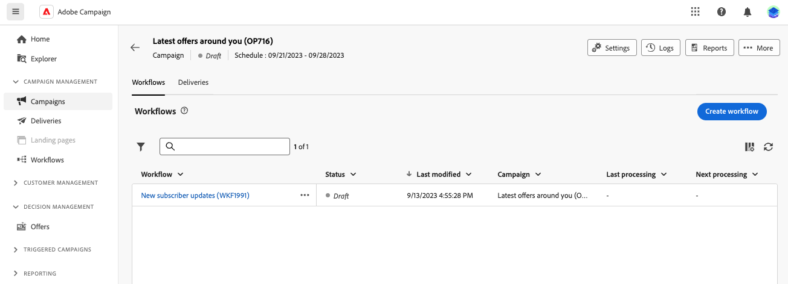

# Viktiga principer för att skapa arbetsflöden {#gs-workflow-creation}

Med Adobe Campaign Web kan du skapa arbetsflöden i en visuell arbetsyta för att skapa flerkanalsprocesser som segmentering, kampanjutförande och filbearbetning.

## Vad innehåller ett arbetsflöde? {#gs-workflow-inside}

Arbetsflödesdiagrammet är en representation av vad som ska hända. Det beskriver de olika åtgärder som ska utföras och hur de är sammankopplade.

 {zoomable=&quot;yes&quot;}

Varje arbetsflöde innehåller:

* **Verksamhet**: En aktivitet är en uppgift som ska utföras. De olika aktiviteterna visas i diagrammet med ikoner. Varje aktivitet har specifika egenskaper och andra egenskaper som är gemensamma för alla aktiviteter.

  I ett arbetsflödesdiagram kan en viss aktivitet producera flera uppgifter, särskilt när det finns en slinga eller återkommande åtgärder.

* **Övergångar**: Övergångar länkar en källaktivitet till en målaktivitet och definierar deras sekvens.

* **Worktables**: Arbetstabellen innehåller all information som övergången innehåller. För varje arbetsflöde används flera arbetstabeller. De data som överförs i dessa tabeller kan användas under hela arbetsflödets livscykel.

## Viktiga steg för att skapa ett arbetsflöde {#gs-workflow-steps}

Det finns två sätt att skapa ett arbetsflöde i kampanjer:

1. Arbetsflöden kan skapas som fristående arbetsflöden från **Arbetsflöden** -menyn.

   

1. Arbetsflöden kan skapas direkt i en kampanj från **Arbetsflöde** -fliken i kampanjen. När det ingår i en kampanj körs arbetsflödet tillsammans med alla andra kampanjers arbetsflöden, och alla rapportvärden grupperas på kampanjnivå.

   

Så här skapar du arbetsflöden:

De här stegen beskrivs i följande avsnitt:

1. [Skapa ett arbetsflöde och definiera dess egenskaper](create-workflow.md)
1. [Samordna och konfigurera aktiviteter](orchestrate-activities.md)
1. [Konfigurera avancerade inställningar för ditt arbetsflöde](workflow-settings.md)
1. [Starta arbetsflödet och övervaka dess körning](start-monitor-workflows.md)
