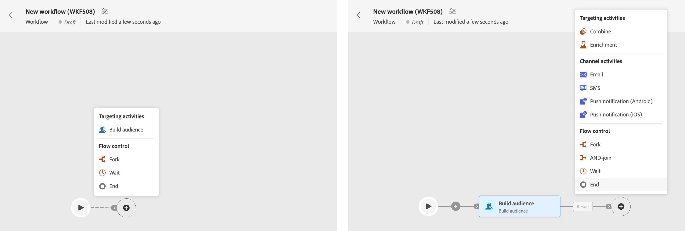
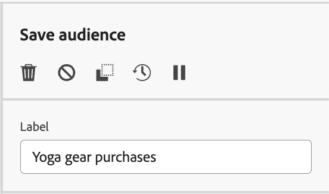

# Organisera aktiviteter {#orchestrate}

En gång har du [skapade ett arbetsflöde](create-workflow.md), oavsett om det gäller arbetsflödesmenyn eller en kampanj, kan du börja organisera de olika uppgifter som ska utföras. För att göra detta finns en visuell arbetsyta som gör att du kan skapa ett arbetsflödesdiagram. I det här diagrammet kan du lägga till olika aktiviteter och koppla dem i en sekventiell ordning.

## Lägg till aktiviteter {#add}

I det här skedet av konfigurationen visas diagrammet med en startikon som representerar början av arbetsflödet. Om du vill lägga till din första aktivitet klickar du på **+** som är ansluten till startikonen.

En lista över aktiviteter som kan läggas till i diagrammet visas. Vilka aktiviteter som är tillgängliga beror på var du befinner dig i arbetsflödesdiagrammet. När du till exempel lägger till din första aktivitet kan du starta arbetsflödet genom att rikta in dig på en målgrupp, dela arbetsflödet eller ställa in en **Vänta** för att fördröja arbetsflödets körning. Å andra sidan, efter **Bygg målgrupper** kan du förfina målgruppen med målinriktade aktiviteter, skicka en leverans till målgruppen med kanalaktiviteter eller organisera arbetsflödet med flödeskontrollaktiviteter.

{zoomable=&quot;yes&quot;}

När en aktivitet har lagts till i diagrammet visas en höger ruta där du kan konfigurera den nyligen tillagda aktiviteten med specifika inställningar. Detaljerad information om hur du konfigurerar varje aktivitet finns i [det här avsnittet](activities/about-activities.md).

{zoomable=&quot;yes&quot;}

Upprepa den här processen om du vill lägga till så många aktiviteter som du vill, beroende på vilka uppgifter du vill att arbetsflödet ska utföra. Observera att du även kan infoga en ny aktivitet mellan två aktiviteter. Klicka på **+** om övergången mellan aktiviteterna markerar du önskad aktivitet och konfigurerar den i den högra rutan.

Om du vill ta bort en aktivitet markerar du den på arbetsytan och klickar på knappen **Ta bort** -ikonen i aktivitetsegenskaperna.

>[!TIP]
>
>Du kan anpassa namnet på övergångarna mellan varje aktivitet. Det gör du genom att markera övergången och ändra dess etikett i den högra rutan.

## Hantera aktiviteter {#manage}

När du lägger till aktiviteter är åtgärdsknappar tillgängliga i egenskapsrutan, vilket gör att du kan utföra flera åtgärder. Du kan:

* **Ta bort** aktiviteten från arbetsytan.
* **Inaktivera/aktivera** aktiviteten. När arbetsflödet körs körs inte inaktiverade aktiviteter och följande aktiviteter på samma sökväg, och arbetsflödet stoppas.
* **Kopiera** aktiviteten. Du kan sedan klistra in den i valfritt arbetsflöde genom att klicka på **+** och väljer&quot;Klistra in 1 aktivitet&quot;.
* Åtkomst till aktivitetens **Loggar och uppgifter**.
* **Pausa/återuppta** aktiviteten. När arbetsflödet körs pausas det vid den pausade aktiviteten. Motsvarande uppgift och alla som följer den i samma sökväg körs inte.

{zoomable=&quot;yes&quot;}{width="50%"}

## Exempel {#example}

Här följer ett exempel på ett arbetsflöde som utformats för att skicka ett e-postmeddelande till alla kunder (utom VIP kunder) med ett e-postmeddelande som är intresserade av kaffemaskiner.

{zoomable=&quot;yes&quot;}{zoomable=&quot;yes&quot;}

För att uppnå detta har följande aktiviteter lagts till:

* A **[!UICONTROL Fork]** Aktivitet som delar upp arbetsflödet i tre banor (en för varje kundgrupp).
* **[!UICONTROL Build audience]** Verksamheter för att inrikta sig på de tre olika kundgrupperna:

   * Kunder med e-post
   * Kunder som tillhör den befintliga målgruppen&quot;Interasted in Coffee Machine(s)&quot;,
   * Kunder som tillhör den befintliga målgruppen&quot;VIP eller belöning&quot;.

* A **[!UICONTROL Combine]** aktiviteter som grupperar kunder med e-post och de som är intresserade av kaffemaskiner,
* A **[!UICONTROL Combine]** verksamhet som utesluter VIP kunder,
* An **[!UICONTROL Email delivery]** aktivitet som skickar ett e-postmeddelande till de resulterande kunderna.

När du är klar med arbetsflödet lägger du till en **[!UICONTROL End]** aktiviteten i slutet av diagrammet. Med den här aktiviteten kan du markera slutet av ett arbetsflöde visuellt och inte ha någon funktionell inverkan.

När du har utformat arbetsflödesdiagrammet kan du köra arbetsflödet och spåra förloppet för dess olika uppgifter. [Lär dig hur du startar ett arbetsflöde och övervakar hur det körs](start-monitor-workflows.md)
