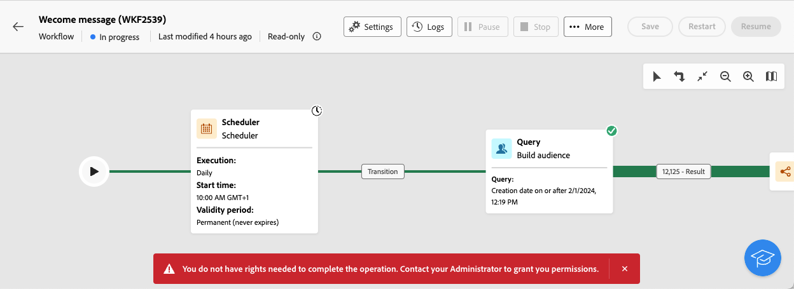

# Om skrivskyddade arbetsflöden {#readonly-workflows}

>[!CONTEXTUALHELP]
>id="acw_wf_read_only_canvas"
>title="Arbetsflödet är skrivskyddat"
>abstract="Du kan inte redigera det här arbetsflödet på grund av dina rättigheter eller arbetsflödets typ."

Vissa arbetsflöden är skrivskyddade. Inbyggda tekniska arbetsflöden är alltid skrivskyddade, men den här strukturen kan också aktiveras i andra typer av arbetsflöden.

Kampanjanvändare kan ha begränsad åtkomst till Adobe Campaign-data. En kampanjadministratör kan ge dem behörighet att visa vissa funktioner, men inte att redigera eller ändra dem. Användarbehörigheter för data är avgörande för att säkerställa data- och processsäkerhet. Läs mer om behörighetshantering i Campaign i [det här avsnittet](../get-started/permissions.md)

När ett arbetsflöde är skrivskyddat:

* The mention **[!UICONTROL Read-only]** near the **[!UICONTROL Settings]** button
* Åtgärdsknapparna är inte tillgängliga

{zoomable="yes"}

Användare kan inte redigera något i ett skrivskyddat arbetsflöde. de får inte ändra inställningarna för aktiviteterna.

{zoomable="yes"}

Användare kan inte ta bort arbetsflödet.

{zoomable="yes"}

## Typer av skrivskyddade arbetsflöden {#readonly-workflow-types}

Beroende på arbetsflödets typ kan skrivskyddat läge vara annorlunda.

### Kampanjarbetsflöden {#readonly-campaign-wf}

Användaren kan inte komma åt övervakningsknappen om det finns ett skrivskyddat kampanjarbetsflöde.

{zoomable="yes"}

### Tekniska arbetsflöden {#readonly-tech-wf}

Inbyggda tekniska arbetsflöden är skrivskyddade för alla kampanjanvändare, även för administratören. Användarna kan dock **pausa** eller **stoppa** dem vid behov. Det är de enda tillåtna åtgärderna.

{zoomable="yes"}

Läs mer om tekniska arbetsflöden i [det här avsnittet](https://experienceleague.adobe.com/en/docs/campaign/automation/workflows/introduction/wf-type/technical-workflows)
